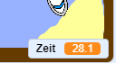

## Hinzufügen eines Timers

Fügen wir eine Stoppuhr zu deinem Spiel hinzu, sodass der Spieler die Insel unten links so schnell wie möglich erreichen muss.

\--- task \---

Erstelle eine neue Variable namens `Zeit`{:class='block3variable'}.



[[[generic-scratch3-add-variable]]]

Du kannst die Anzeige der Variable Zeit anschalten und die Anzeige der Variablen an jede stelle der Bühne verschieben. Verschiebe die Anzeige nach unten rechts wenn du willst.

\--- /task \---

\--- task \---

Jetzt wähle Code für deine Bühne aus, damit die Stoppuhr die Zeit misst, bis das Boot die einsame Insel erreicht.

\--- Hinweise \--- \--- Hinweis \--- Auf der Bühne, ` wenn die grüne Flagge angeklickt wird ` {: class = "block3control"}, ` setze die Zeit auf 0 ` {: class = "block3variables"}. Innerhalb deines `fortlaufend`{:class="block3control"} Schleife, musst du erst `0.1 Sekunden warten`{:class="block3control"} und anschließend `die Zeit um 0.1 Sekungen ändern`{:class="block3variables"}. \--- /hint \--- \--- hint \--- Hier sind die Codeblöcke die du brauchst: 

```blocks3
ändere [Zeit v] um (0.1)

Wenn grüne Flagge angecklickt wird

wiederhole fortlaufend
ende

warte (0.1) Sekunden

setze [Zeit v] auf [0]
```

\--- /hint \--- \--- hint \--- So sollte dein neuer Programmiercode aussehen: 

```blocks3
Wenn grüne Flagge angeklickt wird
setze [Zeit v] auf [0]
wiederhole fortlaufend
warte (0.1) Sekunden
ändere [Zeit v] um (0.1)
ende
```

\--- /hint \--- \--- /hints \---

\--- /task \---

\--- task \---

Das ist alles! Teste dein Spiel aus und probiere aus wie schnell du die einsame Insel erreichen kannst!


\--- /task \---