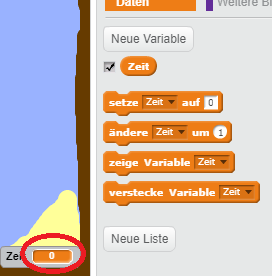
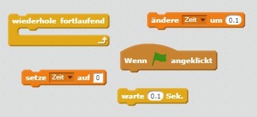
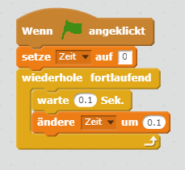
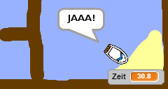

## Zeitfahren

Fügen wir einen Timer zu deinem Spiel hinzu. Der Spieler muss die einsame Insel dann so schnell wie möglich erreichen.

\--- task \---

Füge deiner Bühne eine neue Variable `Zeit` hinzu. Du kannst auch die Anzeige deiner neuen Variable ändern.

[[[generic-scratch-add-variable]]]

\--- /task \---

\--- task \---

Jetzt wähle Code für deine Bühne aus, damit der Timer die Zeit nimmt bis das Boot die einsame Insel erreicht.

\--- hints \--- \--- hint \--- Auf der Bühne, `wenn die grüne Fahne angeklickt wird`, `die Zeit auf 0 setzen`. Innerhalb deines `wiederhole fortlaufend` Blockes musst Du erst `0.1 Sekunden warten` und dann `die Zeit um 0.1 ändern`. \--- /hint \--- \--- hint \--- Hier sind die Code-Blöcke, die du brauchen wirst:  \--- /hint \--- \--- hint \--- So sollte dein Code aussehen:  \--- /hint \--- \--- /hints \---

\--- /task \---

\--- task \---

Das ist alles! Teste dein Spiel und probiere aus wie schnell du die einsame Insel erreichen kannst!

\--- /task \---