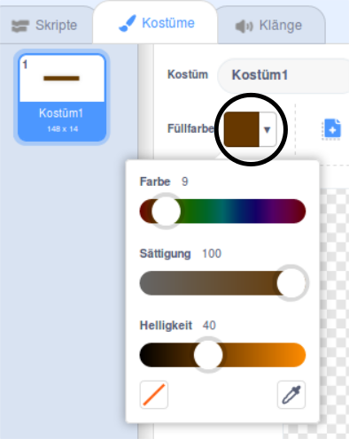

## Zeitfahren

Also, dieses Spiel ist **echt** zu einfach - damit es interessanter wird, lass' uns einige Sachen ergänzen.

Fügen wir zuerst einige Beschleunigungen in dein Spiel ein, um das Boot schneller zu machen. 

\--- task \---

Bearbeite dein Bühnenbild und füge einige weiße Beschleunigungspfeile hinzu.


\--- /task \---

\--- task \---

Jetzt erweitere den Code in der Wiederhole-fortlaufend-Schleife des Bootes so, dass es sich drei Schritte zusätzlich nach vorne bewegt, wenn es einen weißen Pfeil berührt. 

```blocks3
wenn <touching color [#FFFFFF] ?> dann 
gehe (3) er Schritt
ende
```

\--- /task \---

\--- task \---

Teste dein Spiel, um zu sehen, ob das Boot schneller wird, sobald es einen weissen Pfeil berührt.

\--- /task \---

Als nächstes kannst du ein drehendes Hinderniss hinzufügen, dass das Boot nicht berühren darf.

\--- task \---

Erstelle eine neue Figur die wie folgt aussieht und geb ihr den Namen “Hindernis”:


Achte darauf, dass die Farbe der Figur "Hindernis" genau der braunen Farbe der Hindernisse auf der Bühne gleicht.



\--- /task \---

\--- task \---

Stelle sicher, dass der Mittelpunkt der Balken Figur genau in der Mitte der Figur liegt


\--- /task \---

\--- task \---

Füge den Code für die Balken Figur hinzu, damit er sich langsam und fortlaufend dreht.

\--- hints \--- \--- hint \--- Add code blocks to the gate sprite so that it `turns 1 degree`{:class="block3motion"} `forever`{:class="block3control"}. \--- /hint \--- \--- hint \--- Here are the code blocks you need: 

```blocks3
wiederhole fortlaufend
ende

drehe dich im Uhrzeigersinn um (1) Grad

Wenn die grüne Flagge angeklickt wird
```

\--- /hint \--- \--- hint \--- Here's what your new code should look like: 

```blocks3
Wenn grüne Flagge angeklickt wird
wiederhole fortlaufend
drehe dich im Uhrzeigersinn um (1) Grad
ende
```

\--- /hint \--- \--- /hints \---

\--- /task \---

\--- task \---

Test your game again. You should now have a spinning gate that you need to stir your boat around.


\--- /task \---