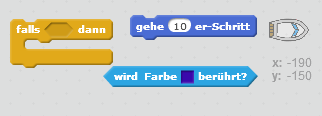
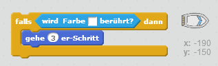
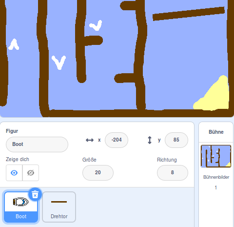
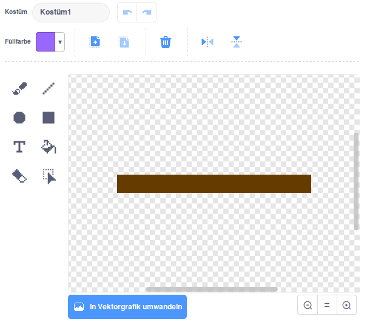
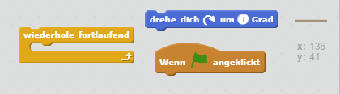
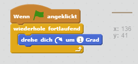
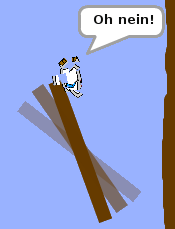

## Hindernisse und Power-ups

Also, dieses Spiel ist *echt* zu einfach - damit es interessanter wird, lass' uns einige Sachen ergänzen.

\--- task \---

Fügen wir zuerst einige "Boosts" in dein Spiel ein, um das Boot anzutreiben. Bearbeite deine Bühne und füge einige weiße Beschleunigungspfeile hinzu.

\--- /task \---

\--- task \---

Now add some code to your boat's forever loop so that it moves three extra steps when it touches a white booster.

\--- hints \--- \--- hint \--- `If` your boat is `touching a white booster`, then it should `move 3 extra steps`.  
\--- /hint \--- \--- hint \--- Here are the code blocks you'll need:  \--- /hint \--- \--- hint \--- Here's what your code should look like:  \--- /hint \--- \--- /hints \---

\--- /task \---

\--- task \---

You can also add a spinning gate which your boat will have to avoid. Add a new sprite called 'gate' that looks like this:

Make sure that the colour of the gate is the same as that of the wooden barriers.

\--- /task \---

\--- task \---

Set the center of the gate sprite.

\--- /task \---

\--- task \---

Add code to your gate to make it spin slowly forever.

\--- hints \--- \--- hint \--- Add code to the gate sprite so that it `turns 1 degree` `forever`. \--- /hint \--- \--- hint \--- Here are the code blocks you'll need:  \--- /hint \--- \--- hint \--- Here's what your code should look like:  \--- /hint \--- \--- /hints \---

\--- /task \---

\--- task \---

Test out your game. You should now have a spinning gate that you must avoid.

\--- /task \---