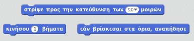
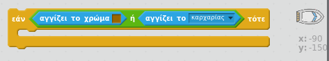

\--- challenge \---

## Challenge: περισσότερα εμπόδια!

Μπορείς να προσθέσεις περισσότερα εμπόδια στο παιχνίδι σου; Ακολουθούν μερικές ιδέες:

\--- task --

Θα μπορούσες να προσθέσεις πράσινη λάσπη στο υπόβαθρό σου και να κάνεις αλλαγές στο παιχνίδι, έτσι ώστε η λάσπη να επιβραδύνει τη βάρκα όταν την αγγίξει.

\--- hints \--- \--- hint \--- Μπορείς να χρησιμοποιήσεις ένα μπλοκ `περίμενε` για να το κάνεις αυτό:  \--- /hint \--- \--- /hints \---

\--- /task \---

\--- task --

Θα μπορούσες να προσθέσεις ένα κινούμενο αντικείμενο όπως ένα κούτσουρο ή ένα καρχαρία!

\--- hints \--- \--- hint \--- Αυτά τα μπλοκ κώδικα θα σε βοηθήσουν να μετακινήσεις το νέο σου αντικείμενο:

Αν το νέο σου αντικείμενο δεν είναι καφέ, θα πρέπει να προσθέσεις στον κώδικα της βάρκας σου:

 \--- /hint \--- \--- /hints \---

\--- /task \---

\--- /challenge \---