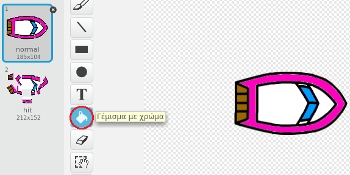

--- challenge ---

## Πρόκληση: περισσότερες βάρκες!

Μπορείς να μετατρέψεις το παιχνίδι σου σε αγώνα μεταξύ 2 παικτών; Ο δεύτερος παίκτης θα πρέπει να ελέγχει τη βάρκα του χρησιμοποιώντας το πάνω βέλος για να προχωρά και το αριστερό και δεξί βέλος για να στρίβει.

--- hints --- --- hint --- Αντίγραψε τη βάρκα και άλλαξε το χρώμα του βάρκα2.

 --- /hint --- --- hint --- Κάνε τις δύο βάρκες να ξεκινούν από διαφορετικά μέρη αλλάζοντας αυτόν τον κώδικα:

 --- /hint --- --- hint --- Διάγραψε τον κώδικα της βάρκα2 που χρησιμοποιεί το ποντίκι και αντικατάστησέ τον με κώδικα για να ελέγχεις τη βάρκα2 χρησιμοποιώντας τα πλήκτρα βέλους. --- /hint --- --- hint --- Αυτός είναι ο κώδικας που θα χρειαστεί για να μετακινείς τη βάρκα2 προς τα εμπρός:

 --- /hint --- --- hint --- Θα χρειαστεί επίσης κώδικα για να *στρίβεις* τη βάρκα όταν πατήσεις το αριστερό και δεξί βέλος. --- /hint --- --- /hints ---

--- /challenge ---