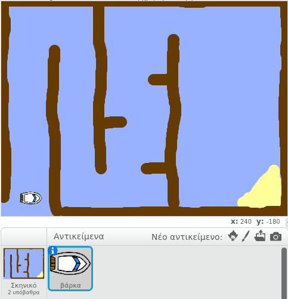

## Ξεκινώντας

\--- task --

Άνοιξε το αρχικό έργο.

## \--- collapse \---

title: Χρησιμοποιώ το Scratch online

## image: images/image.png

Άνοιξε το αρχικό έργο "Boat Race" στο [jumpto.cc/boat-go](https://scratch.mit.edu/projects/63958014/#editor){:target="_blank"}. \--- /collapse \---

## \--- collapse \---

title: Χρησιμοποιώ το Scratch offline

## image: images/image.png

Κατέβασε το αρχικό έργο 'Boat Race' από το [jumpto.cc/boat-get](http:jumpto.cc/boat-get){:target="_blank"} και στη συνέχεια, άνοιξέ το χρησιμοποιώντας την offline εφαρμογή. \--- /collapse \---

\--- /task \---

\--- task --

Το έργο περιλαμβάνει μία βάρκα (αντικείμενο) και μια πίστα (υπόβαθρο) με:

- Ξύλα που πρέπει να αποφύγει η βάρκα σου
- Ένα έρημο νησί στο οποίο πρέπει να φτάσει η βάρκα σου
    
    

\--- /task \---