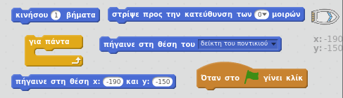
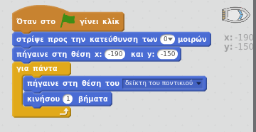
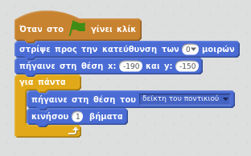
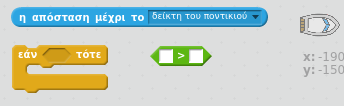
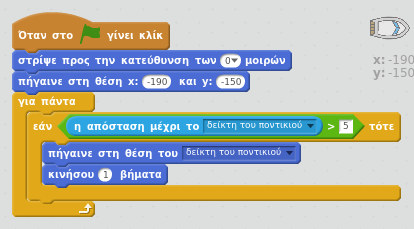

## Ελέγχοντας τη βάρκα

\--- task --

Πρόκειται να ελέγξεις τη βάρκα με το ποντίκι σου. Πρόσθεσε κώδικα στη βάρκα σου έτσι ώστε να ξεκινά στην κάτω αριστερή γωνία, στραμμένη προς τα πάνω και στη συνέχεια να ακολουθεί το δείκτη του ποντικιού. **Δοκίμασε τον κώδικά σου** για να βεβαιωθείς ότι κάνει αυτό που πρέπει.

\--- hints \--- \--- hint \--- Μόλις `πατηθεί η πράσινη σημαία`, θα πρέπει να κάνεις τη βάρκα σου `να μεταβεί στη θέση εκκίνησης` και `να στραφεί προς τα πάνω`. Στη συνέχεια, θα πρέπει να `δείχνει προς τον δείκτη του ποντικιού` και `να μετακινείται ένα βήμα`. Θα πρέπει να το επαναλαμβάνει `για πάντα`.

\--- /hint \--- \--- hint \--- Εδώ είναι τα μπλοκ κώδικα που θα χρειαστείς:  \--- /hint \--- \--- hint \--- Έτσι πρέπει να είναι ο κώδικάς σου:  \--- /hint \--- \--- /hints \---

\--- /task \---

\--- task --

Δοκίμασε τη βάρκα σου κάνοντας κλικ στη σημαία και μετακινώντας το ποντίκι. Η βάρκα κατευθύνεται προς το ποντίκι;

## \--- collapse \---

title: Αν έχεις προβλήματα ...

## image: images/image.png

**Σημείωση:** Υπάρχει ένα σφάλμα στο Scratch που σημαίνει ότι η βάρκα σου μπορεί να μην κινείται προς το δείκτη του ποντικιού. Εάν συμβαίνει αυτό, πάτησε στο βέλος του μπλοκ `στρίψε προς το` και επέλεξε εκ νέου τον `δείκτη ποντικιού`.

 \--- /collapse \---

\--- /task \---

\--- task --

Τι συμβαίνει αν η βάρκα φτάσει στο δείκτη του ποντικιού; Δοκίμασέ το.

\--- /task \---

\--- task --

Για να μη συμβαίνει αυτό, θα πρέπει να προσθέσεις ένα `αν` μπλοκ στον κώδικά σου, έτσι ώστε η βάρκα να κινείται μόνο αν είναι περισσότερο από 5 εικονοστοιχεία μακριά από το ποντίκι.

\--- hints \--- \--- hint \--- Η βάρκα πρέπει να δείχνει μόνο προς το δείκτη του ποντικιού και να μετακινείται `εάν` `η απόσταση μέχρι το δείκτη του ποντικιού` είναι `μεγαλύτερη από 5 εικονοστοιχεία`. \--- /hint \--- \--- hint \--- Εδώ είναι τα μπλοκ κώδικα που θα χρειαστεί να προσθέσεις στον κώδικα για τη βάρκα:  \--- /hint \--- \--- hint \--- Έτσι πρέπει να είναι ο κώδικάς σου:  \--- /hint \--- \--- /hints \---

\--- /task \---

\--- task --

Δοκίμασε ξανά τη βάρκα σου για να ελέγξεις αν το πρόβλημα έχει διορθωθεί.

\--- /task \---