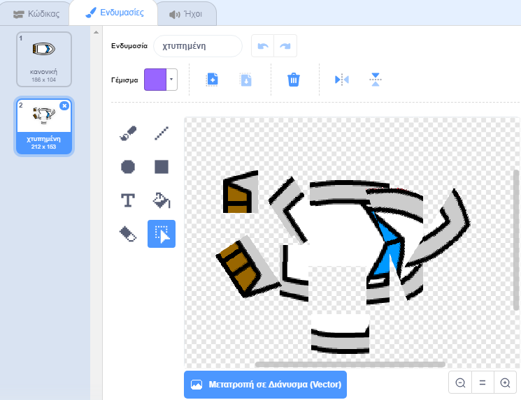

## Συντριβή!

Προς το παρόν, η βάρκα μπορεί απλά να πλοηγείται μέσα από τα ξύλινα φράγματα! Θα το διορθώσεις αυτό, τώρα.

\--- task --

Χρειάζεσαι δύο ενδυμασίες για το αντικείμενο βάρκα: μια κανονική και μια για όταν η βάρκα συντριβεί. Διπλασίασε την ενδυμασία του αντικειμένου βάρκα και ονόμασε τη μια ενδυμασία 'κανονική' και την άλλη 'χτυπημένη'.

\--- /task \---

\--- task --

Κάνε κλικ στην ενδυμασία 'χτυπημένη' και χρησιμοποίησε το εργαλείο **Επιλογή** για να αρπάξεις τα κομμάτια της ενδυμασίας, να τα μετακινήσεις και να τα περιστρέψεις ώστε να κάνεις τη βάρκα να φαίνεται σαν να έχει συντριβεί σε κομμάτια.



\--- /task \---

\--- task --

Τώρα πρόσθεσε κώδικα στη βάρκα σου ώστε να συντρίβεται και να σπάει όταν αγγίζει τα καφέ ξύλινα φράγματα.

\--- hints \--- \--- hint \---

You need to add code blocks inside your `forever`{:class="block3control"} loop so that your code keeps checking if the boat sprite has crashed, and if it has crashed, the code needs to reset the boat sprite's position.

`if`{:class="block3control"} the boat is `touching`{:class="block3sensing"} the brown colour of the wood, you need to `switch to the hit costume`{:class="block3looks"}, `say Noooo! for 2 seconds`{:class="block3looks"}, and then `switch back to the normal costume`{:class="block3looks"}. Finally, you'll need to `point up`{:class="block3motion"} and `go to the start position`{:class="block3motion"}.

\--- /hint \--- \--- hint \---

Here are the code blocks you need:


```blocks3
εάν <touching color [ ] ?> τότε
end

πήγαινε σε θέση x: (-190) y:(-150)

άλλαξε ενδυμασία σε (hit v)

δείξε προς κατεύθυνση (0)

άλλαξε ενδυμασία σε (normal v)

πες [Όχιιιιι!] για (2) δευτερόλεπτα
```

\--- /hint \--- \--- hint \---

Here's what your code should look like:


```blocks3
Όταν στην πράσινη σημαία γίνει κλικ
δείξε προς κατεύθυνση (0)
πήγαινε σε θέση x: (-190) y: (-150)
για πάντα 
  εάν <(απόσταση έως (mouse-pointer v)) > [5]> τότε 
    δείξε προς (mouse-pointer v)
    κινήσου (1) βήματα
  end
  εάν <αγγίζει χρώμα [#663b00] ;> τότε 
    άλλαξε ενδυμασία σε (hit v)
    πες [Όχιιιιιι!] για (2) δευτερόλεπτα
    άλλαξε ενδυμασία σε (normal v)
    δείξε προς κατεύθυνση (0)
    πήγαινε σε θέση x: (-190) y: (-150)
  end
```

\--- /hint \--- \--- /hints \---

\--- /task \---

\--- task \---

You should also add code to make sure that your boat sprite always starts out looking 'normal'.

Test your code again. If you try to sail the boat through a wooden barrier now, the boat should crash and then move back to its starting position.


\--- /task \---