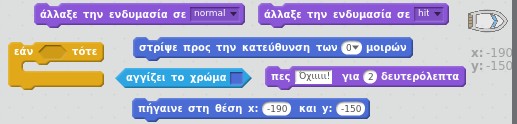
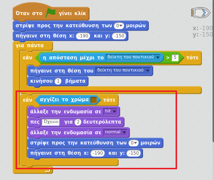
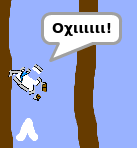

## Συντριβή!

Προς το παρόν, η βάρκα σου μπορεί να πλεύσει μέσα από τα ξύλινα φράγματα! Ας το διορθώσουμε αυτό.

\--- task --

Θα χρειαστείς δύο ενδυμασίες για τη βάρκα σου, μία κανονική και μία για όταν η βάρκα συντρίβεται. Διπλασίασε την ενδυμασία της βάρκας σου και ονόμασε τη μία 'normal' και την άλλη 'hit'.

\--- /task \---

\--- task --

Πάτησε στην ενδυμασία 'hit', επέλεξε το εργαλείο επιλογής και πάρε κομμάτια της βάρκας για να τα μετακινήσεις και περιστρέψεις ώστε να φανεί σαν να έχει συντριβεί.

\--- /task \---

\--- task --

Τώρα πρόσθεσε κώδικα στη βάρκα σου, ώστε να συντριβεί και να σπάσει όταν αγγίζει τα καφέ ξύλινα κομμάτια.

\--- hints \--- \--- hint \--- Πρέπει να προσθέσεις κώδικα μέσα στον βρόχο `για πάντα` έτσι ώστε ο κώδικάς σου να ελέγχει αν η βάρκα έχει συντριβεί. `Εάν` η βάρκα `αγγίζει` το καφέ χρώμα του ξύλου, πρέπει να `αλλάξεις στην ενδυμασία συντριβής`, `πες Όχιιι! για 2 δευτερόλεπτα`και μετά `αλλάξε πίσω στην κανονική ενδυμασία`. Τέλος, θα πρέπει η βάρκα `να δείχνει προς τα πάνω` και `να πάει στη θέση εκκίνησης`. \--- /hint \--- \--- hint \--- Εδώ είναι τα μπλοκ κώδικα που θα χρειαστείς:  \--- /hint \--- \--- hint \--- Έτσι πρέπει να είναι ο κώδικάς σου:  \--- /hint \--- \--- /hints \---

\--- /task \---

\--- task --

Θα πρέπει επίσης να βεβαιωθείς ότι η βάρκα σου ξεκινά με την κανονική ενδυμασία.

Αν προσπαθήσεις τώρα να πλεύσεις μέσα από ένα ξύλινο φράγμα, θα πρέπει να δεις τη βάρκα σου να συντρίβεται και να επιστρέφει στην αρχή.

\--- /task \---