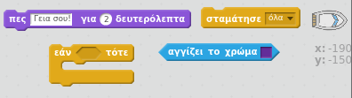
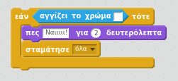

## Πρόκληση: νίκη!

Μπορείς να προσθέσεις άλλο ένα `εάν` μπλοκ στον κώδικα της βάρκας σου, έτσι ώστε ο παίκτης να κερδίσει όταν φτάσει στο νησί της ερήμου;

Όταν η βάρκα φτάσει στο κίτρινο έρημο νησί, το παιχνίδι πρέπει να πει «Ναιιιι!" και μετά να σταματήσει.

--- hints --- --- hint --- Πρέπει να προσθέσεις περισσότερο κώδικα μέσα στο βρόχο `για πάντα` έτσι ώστε να ελέγχεις συνεχώς αν ο παίκτης έχει κερδίσει. `Εάν` η βάρκα `αγγίζει` το χρώμα του νησιού θησαυρού, πρέπει να `πει «Ναιιι! για 2 δευτερόλεπτα` και στη συνέχεια `να σταματήσουν όλα` για να τερματίσει το παιχνίδι. --- /hint --- --- hint --- Εδώ είναι τα μπλοκ κώδικα που θα χρειαστείς: --- /hint --- --- hint --- Έτσι πρέπει να είναι ο κώδικάς σου: 

Μην ξεχνάς ότι ο νέος κώδικας πρέπει να είναι μέσα στο βρόχο `για πάντα`. --- /hint --- --- /hints ---