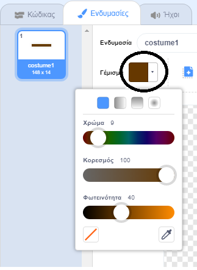

## Εμπόδια και επιταχυντές

Αυτή τη στιγμή το παιχνίδι είναι **πάρα πολύ** εύκολο, έτσι λοιπόν θα προσθέσεις κάποια πράγματα για να το κάνεις περισσότερο ενδιαφέρον.

Κατ' αρχάς θα προσθέσεις μερικούς επιταχυντές που θα επιταχύνουν τη βάρκα σου.

\--- task --

Επεξεργάσου το υπόβαθρο του Σκηνικού σου προσθέτοντας μερικά λευκά βέλη επιτάχυνσης.


\--- /task \---

\--- task --

Τώρα πρόσθεσε μερικά μπλοκ εντολών μέσα στη δομή επανάληψης `για πάντα`{:class="block3control"} έτσι ώστε η βάρκα σου να κινείται τρία επιπλέον βήματα μόλις αγγίζει τα λευκά βέλη. 

```blocks3
εάν <touching color [#FFFFFF] ?> τότε
κινήσου (3) βήματα
end
```

\--- /task \---

\--- task --

Δοκίμασε το παιχνίδι σου για να δεις αν τα νέα βέλη επιτάχυνσης επιταχύνουν όντως τη βάρκα σου.

\--- /task \---

Στη συνέχεια θα προσθέσεις μια περιστρεφόμενη πύλη την οποία θα πρέπει να αποφύγει η βάρκα σου.

\--- task --

Πρόσθεσε ένα νέο αντικείμενο που να μοιάζει μ' αυτό και ονόμασέ το 'πύλη':


Βεβαιώσου ότι το χρώμα της πύλης είναι το ίδιο με το χρώμα των ξύλινων φραγμάτων.



\--- /task \---

\--- task \---

Make sure that the centre of the gate sprite is positioned in the middle.


\--- /task \---

\--- task \---

Add code to your gate sprite to make it spin slowly forever.

\--- hints \--- \--- hint \--- Add code blocks to the gate sprite so that it `turns 1 degree`{:class="block3motion"} `forever`{:class="block3control"}. \--- /hint \--- \--- hint \--- Here are the code blocks you need: 

```blocks3
για πάντα
end

στρίψε δεξιόστροφα (1) μοίρες

Όταν στην πράσινη σημαία γίνει κλικ
```

\--- /hint \--- \--- hint \--- Here's what your new code should look like: 

```blocks3
Όταν στην πράσινη σημαία γίνει κλικ
για πάντα 
  στρίψε δεξιόστροφα (1) μοίρες
end
```

\--- /hint \--- \--- /hints \---

\--- /task \---

\--- task \---

Test your game again. You should now have a spinning gate that you need to stir your boat around.


\--- /task \---