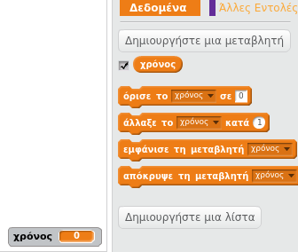
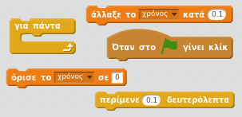
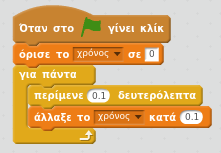
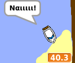

## Δοκιμαστική χρονομέτρηση

Ας προσθέσουμε ένα χρονόμετρο στο παιχνίδι σου, έτσι ώστε ο παίκτης να πρέπει να φτάσει στο έρημο νησί το συντομότερο δυνατό.

--- task ---

Πρόσθεσε μια νέα μεταβλητή που ονομάζεται `χρόνος` στο σκηνικό σου. Μπορείς επίσης να αλλάξεις την εμφάνιση της νέας σου μεταβλητής.

[[[generic-scratch-add-variable]]]

--- /task ---

--- task ---

Τώρα πρόσθεσε κώδικα στο σκηνικό σου έτσι ώστε ο χρονομετρητής να μετρά μέχρι να φτάσει η βάρκα στο έρημο νησί.

--- hints --- --- hint --- Στο Σκηνικό, `όταν πατηθεί η πράσινη σημαία`, `όρισε το χρόνο στο 0`. Μέσα στο μπλοκ `για πάντα`, θα πρέπει πρώτα να `περιμένεις 0.1 δευτερόλεπτα`, στη συνέχεια `να αλλάζεις το χρόνο κατά 0.1`. --- /hint --- --- hint --- Εδώ είναι τα μπλοκ κώδικα που θα χρειαστείς:  --- /hint --- --- hint --- Έτσι πρέπει να είναι ο κώδικάς σου:  --- /hint --- --- /hints ---

--- /task ---

--- task ---

Αυτό είναι! Δοκίμασε το παιχνίδι σου και δες πόσο γρήγορα μπορείς να φτάσεις στο έρημο νησί!

--- /task ---
