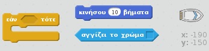
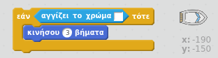
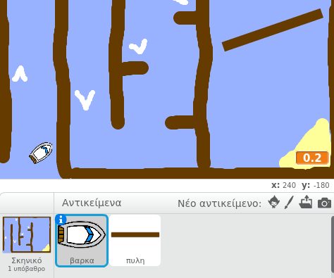
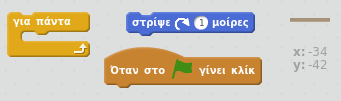
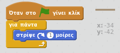
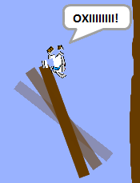

## Εμπόδια και ενισχύσεις

Αυτή τη στιγμή το παιχνίδι είναι *πάρα πολύ* εύκολο - ας προσθέσουμε πράγματα για να το κάνουμε πιο ενδιαφέρον.

--- task ---

Ας προσθέσουμε πρώτα κάποιες «ενισχύσεις» στο παιχνίδι σου για να επιταχύνουμε τη βάρκα. Επεξεργάσου το υπόβαθρο του Σκηνικού σου και πρόσθεσε μερικά λευκά βέλη ενίσχυσης.

--- /task ---

--- task ---

Τώρα πρόσθεσε κώδικα στο βρόχο 'για πάντα' της βάρκας σου, ώστε να κινείται τρία επιπλέον βήματα όταν αγγίζει ένα λευκό ενισχυτή.

--- hints --- --- hint --- `Εάν` η βάρκα σου `αγγίζει ένα λευκό ενισχυτή`, τότε θα πρέπει `να μετακινείται 3 επιπλέον βήματα`.  
--- /hint --- --- hint --- Εδώ είναι τα μπλοκ κώδικα που θα χρειαστείς:  --- /hint --- --- hint --- Έτσι πρέπει να είναι ο κώδικάς σου:  --- /hint --- --- /hints ---

--- /task ---

--- task ---

Μπορείς επίσης να προσθέσεις μια περιστρεφόμενη πύλη την οποία θα πρέπει να αποφύγει η βάρκα σου. Πρόσθεσε ένα νέο αντικείμενο με το όνομα 'πύλη' που μοιάζει έτσι:

Βεβαιώσου ότι το χρώμα της πύλης είναι το ίδιο με το χρώμα των ξύλινων φραγμάτων.

--- /task ---

--- task ---

Όρισε το κέντρο του αντικειμένου 'πύλη'.

--- /task ---

--- task ---

Πρόσθεσε κώδικα στην πύλη σου για να γυρίζει αργά για πάντα.

--- hints --- --- hint --- Πρόσθεσε κώδικα στο αντικείμενο της πύλης έτσι ώστε `να στρίβει 1 μοίρα` `για πάντα`. --- /hint --- --- hint --- Εδώ είναι τα μπλοκ κώδικα που θα χρειαστείς:  --- /hint --- --- hint --- Έτσι πρέπει να είναι ο κώδικάς σου:  --- /hint --- --- /hints ---

--- /task ---

--- task ---

Δοκίμασε το παιχνίδι σου. Θα πρέπει τώρα να έχεις μια περιστρεφόμενη πύλη την οποία πρέπει να αποφύγεις.

--- /task ---
