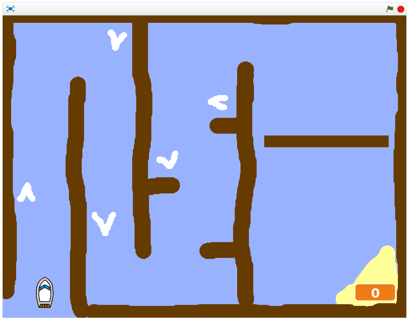

## Introduction

Make a boat racing game! Use the mouse to navigate a boat to an island without bumping into obstacles.

### What you will make

--- no-print ---

Click the **Green Flag** to play:

  <iframe allowtransparency="true" width="485" height="402" src="https://scratch.mit.edu/projects/embed/276662533/?autostart=false" frameborder="0" scrolling="no"></iframe>
  

--- /no-print ---

--- print-only ---

--- /print-only ---

## What you will need

Scratch 3 (either [online](https://rpf.io/scratchon){:target="_blank"} or [offline](https://rpf.io/scratchoff){:target="_blank"})

### Downloads
[Offline starter project](https://rpf.io/p/en/boat-race-go){:target="_blank"}

--- collapse ---
---
title: Additional information for educators
---

If you need to print this project, please use the [printer-friendly version](https://projects.raspberrypi.org/en/projects/boat-race/print){:target="_blank"}.

You can find the [completed project here](https://rpf.io/p/en/boat-race-get){:target="_blank"}.

--- /collapse ---

