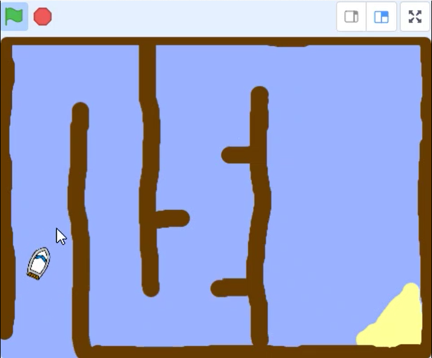

## Controlling the boat

--- task ---

Add this code to the boat sprite so that it starts in the bottom left-hand corner pointing up and then follows the mouse pointer.


```blocks3
when flag clicked
point in direction (0)
go to x: (-190) y: (-150)
forever
point towards (mouse-pointer v)
move (1) steps
```

--- /task ---

--- task ---

__Test your code__ by clicking the green flag and moving the mouse. Does the boat sprite move towards the mouse pointer?

 

--- no-print ---

 
 
--- /no-print ---

--- print-only ---

 
 
--- /print-only ---

--- /task ---

--- task ---

What happens when the boat reaches the mouse pointer? Try it out to see what the problem is.

--- /task ---

--- task ---

Add code to the boat sprite so it only point towards the mouse pointer and moves `if`{:class="block3control"} the `distance to the mouse pointer`{:class="block3sensing"} is `greater than 5 pixels`{:class="block3operators"}.


```blocks3
when flag clicked
point in direction (0)
go to x: (-190) y: (-150)
forever
+if <(distance to (mouse-pointer v)) > [5]> then
point towards (mouse-pointer v)
move (1) steps
```

--- /task ---

--- task ---

Test your code again to check whether the problem is now fixed.

--- /task ---

