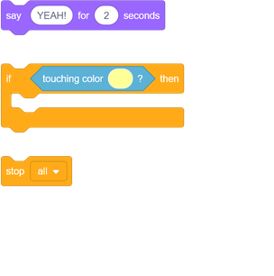

## Winning!

--- task ---
Now add another `if`{:class="block3control"} statement to your boat sprite's code so that the player wins when they make the boat arrive at the yellow island.

When the boat gets to the island, the game should say 'YEAH!', and then it should end.

--- hints ---
--- hint ---
You need to add more code blocks inside your `forever`{:class="block3control"} loop so that your code keeps checking if the player has won:

`if`{:class="block3control"} the boat is `touching`{:class="block3sensing"} the colour of the island, you need to `say 'YEAH!' for 2 seconds`{:class="block3looks"} and then `stop all`{:class="block3control"} to end the game.
--- /hint ---
--- hint ---
Here are the code blocks you need:

--- /hint ---
--- hint ---
Here's what your new code should look like:

Don't forget that this new code needs to be inside the `forever`{:class="block3control"} loop.
--- /hint ---
--- /hints ---
--- /task ---
