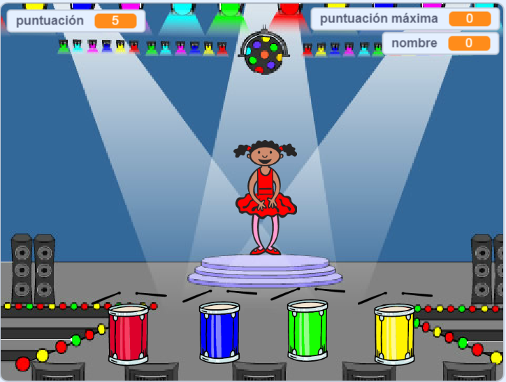

## Desafío: más colores

Congratulations on completing the 'Boat race' project! Would you like to try something a little more challenging?

You could try out the [Memory](https://projects.raspberrypi.org/en/projects/memory?utm_source=pathway&utm_medium=whatnext&utm_campaign=projects) project.

\--- no-print \--- Haz clic en la bandera verde para comenzar. Observa la secuencia de colores que muestra en el vestido de la bailarina y escucha al tambor que lo acompaña, luego repite la secuencia de colores. ¡Si el orden de los colores es incorrecto, el juego termina!

  <iframe allowtransparency="true" width="485" height="402" src="//scratch.mit.edu/projects/embed/284452634/?autostart=false" frameborder="0" allowfullscreen scrolling="no" mark="crwd-mark"></iframe> 

\--- /no-print \---

\--- print-only \---  \--- /print-only \---