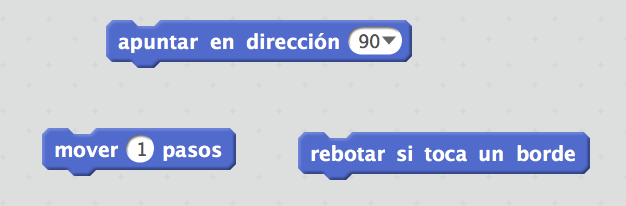
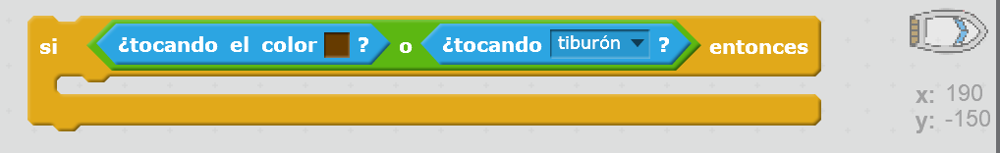

--- challenge ---

## Desafío: ¡más obstáculos!

¿Puedes añadir más obstáculos a tu juego? Aquí te damos algunas ideas:

--- task ---

Podrías añadir cieno verde a tu escenario, que haga que el jugador vaya más lento cuando lo toque.

--- hints --- --- hint --- Para hacer esto, puedes usar un bloque `esperar`:  --- /hint --- --- /hints ---

--- /task ---

--- task ---

¡Podrías añadir un objeto en movimiento, como un tronco o un tiburón!

--- hints --- --- hint --- Estos bloques pueden ayudarte a mover tu nuevo objeto:

Si tu nuevo objeto no es marrón, tendrás que añadir lo siguiente al código de tu barco:

 --- /hint --- --- /hints ---

--- /task ---

--- /challenge ---