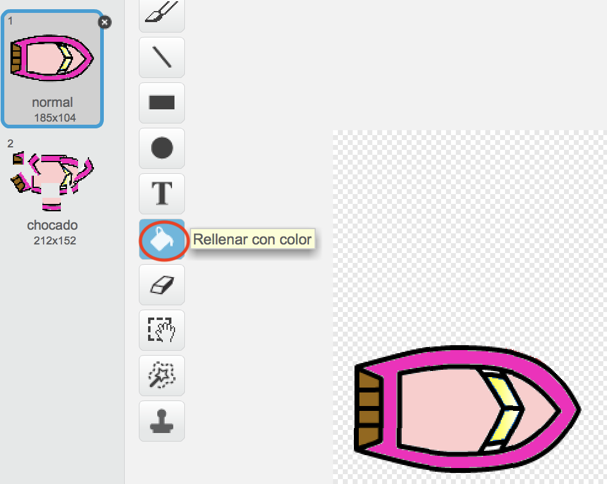
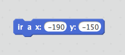
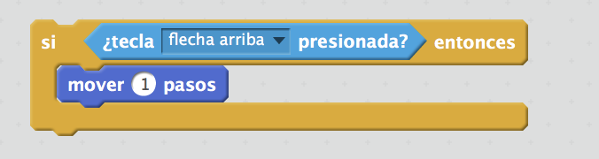

--- challenge ---

## Desafío: ¡más barcos!

¿Puedes convertir tu juego en una carrera entre 2 jugadores? El segundo jugador necesitará controlar su barco usando las teclas flecha "arriba" para avanzar y las teclas "izquierda" y "derecha" para girar.

--- hints --- --- hint --- Crea una copia del barco y cambia el color del segundo barco.

 --- /hint --- --- hint --- Haz que los dos barcos comiencen de puntos diferentes cambiando este código:

 --- /hint --- --- hint --- Borra el código del segundo barco que utiliza el ratón y reemplázalo con uno para controlarlo con las teclas flecha. --- /hint --- --- hint --- Éste es el código que necesitarás para mover hacia delante el segundo barco:

 --- /hint --- --- hint --- También necesitarás un código para *girar* el barco cuando pulses las teclas "izquierda" y "derecha". --- /hint --- --- /hints ---

--- /challenge ---