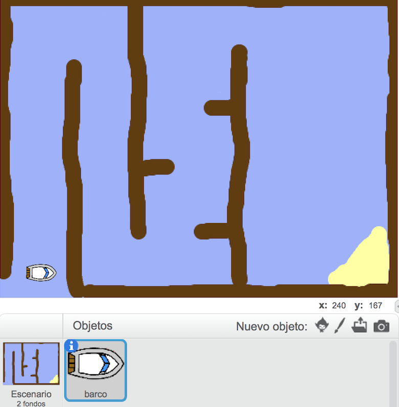

## Primeros pasos

--- task ---

Abre el proyecto inicial.

--- collapse ---
---
title: Estoy usando Scratch online
image: images/image.png
---

Abre el proyecto inicial de Scratch 'Carrera de Barcos' en [jumpto.cc/boat-go](https://scratch.mit.edu/projects/228568130/#editor){:target="_blank"}. --- /collapse ---

--- collapse ---
---
title: Estoy usando Scratch offline
image: images/image.png
---

Descarga el proyecto inicial de Scratch 'Carrera de Barcos' en [jumpto.cc/boat-get](resources/BoatRaceResources.sb2){:download='BoatRaceResources.sb2'} y ábralo con el editor offline. --- /collapse ---

--- /task ---

--- task ---

El proyecto incluye un objeto de barco y un escenario con:

- Madera que tu barco debe evitar
- Una isla desierta adónde tu barco debe llegar
    
    

--- /task ---