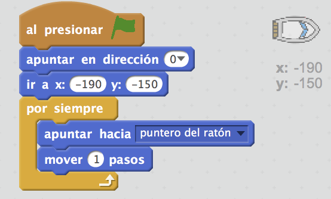
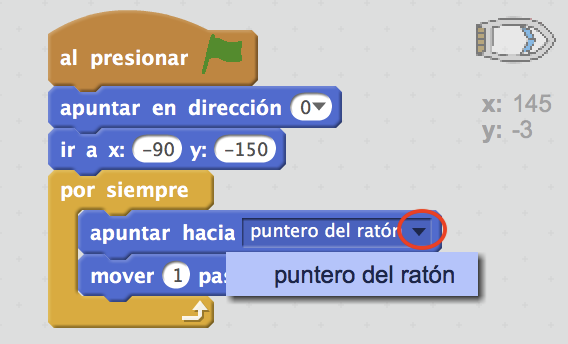
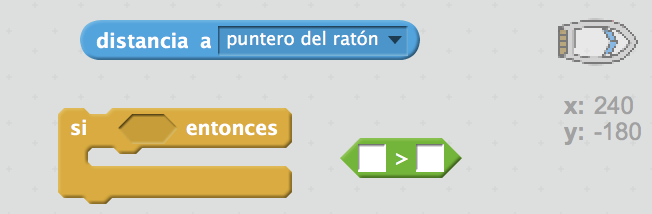
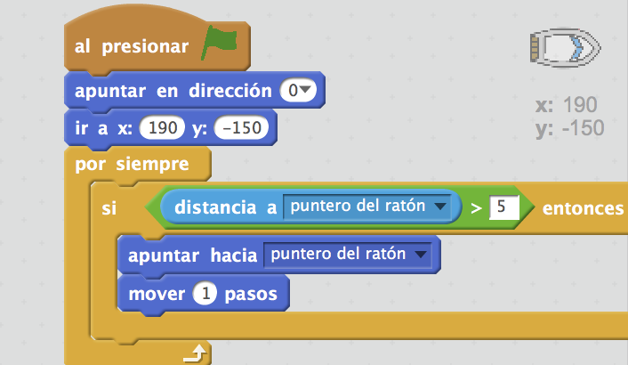

## Controlando el barco

--- task ---

Vas a controlar el barco con el ratón. Agrega el código a tu barco para que comience en la esquina inferior izquierda, apuntado hacia arriba y que luego siga el puntero del ratón. **Prueba tu código** para asegurarte de que hace lo que debería hacer.

--- hints --- --- hint --- Tras `hacer clic en la bandera verde`, tendrás que hacer que tu barco `vaya al punto de partida` y que `se oriente hacia arriba`. Después el barco debe `apuntar hacia el punto del ratón` y `mover 1 paso`. Es necesario que se lo repita `por siempre`.

--- /hint --- --- hint --- Aquí están los bloques de código que necesitarás:  --- /hint --- --- hint --- Aquí es como debe ser tu código:  --- /hint --- --- /hints ---

--- /task ---

--- task ---

Pon a prueba tu barco haciendo clic en la bandera y moviendo el ratón. ¿El barco navega hacia el ratón?

--- collapse ---
---
title: Si tienes problemas ...
image: images/image.png
---

**Nota:** De momento hay un problema con Scratch así que quizás tu barco no navegará hacia el punto de ratón. Si sucede, has clic en la flecha del bloque `apuntar hacia` y selecciona otra vez el `puntero del ratón`.

 --- /collapse ---

--- /task ---

--- task ---

¿Qué pasa si el barco llega al puntero del ratón? Pruébalo.

--- /task ---

--- task ---

Para evitar que esto pase, tendrás que añadir a tu código un bloque`si`, para que el barco solo se mueva si estás a más de 5 píxeles del ratón.

--- hints --- --- hint --- El barco solo debe apuntar hacia el puntero del ratón y mover`si` la `distancia al puntero de ratón` es `mayor que 5 píxeles`. --- /hint --- --- hint --- Aquí están los bloques de código que necesitarás para añadir el código del barco:  --- /hint --- --- hint --- Aquí es como debe ser tu código:  --- /hint --- --- /hints ---

--- /task ---

--- task ---

Prueba tu barco otra vez para ver si el problema se ha solucionado.

--- /task ---