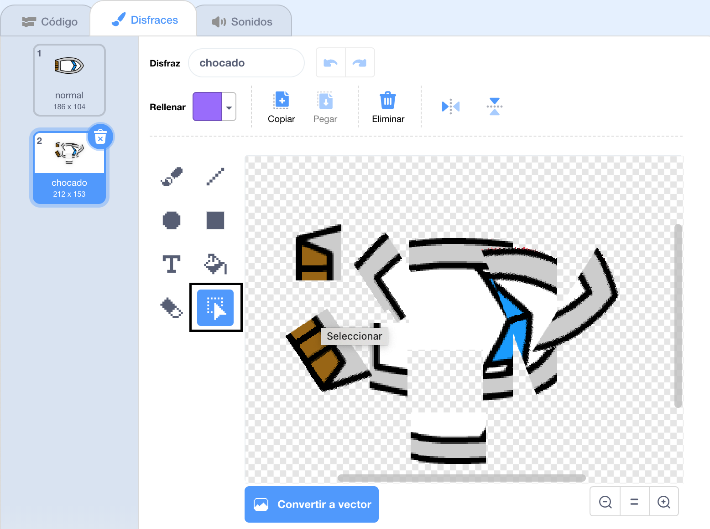

## ¡Chocando!

¡Por ahora, el objeto del barco puede simplemente navegar a través de las barreras de madera! Vas a arreglarlo ahora.

--- task ---

Necesitarás dos disfraces para tu barco: un disfraz normal y uno para cuando el barco choque. Duplica tu disfraz de barco, y nombra uno "normal" y el otro "chocado".

--- /task ---

--- task ---

Haz clic en tu disfraz de "golpe", y usa la herramienta **Seleccionar** para agarrar piezas del disfraz y moverlas y girarlas para hacer que el barco parezca que se ha estrellado en pedazos.



--- /task ---

--- task ---

Ahora agrega código a tu barco para que se choque y se rompa cuando toque cualquier trozo de las barreras de madera marrón.

--- hints ---
 --- hint ---

Necesitas añadir bloques de código dentro de tu bucle `por siempre`{:class="block3control"} para que tu código siga comprobando si el objeto del barco se ha estrellado, y si se ha estrellado, el código necesita reiniciar la posición del objeto del barco.

`si`{:class="block3control"} el barco está `tocando`{:class="block3sensing"} el color marrón de la madera, necesitas `cambiar al disfraz de golpeado`{:class="block3looks"}, `y decir ¡Noooooo! durante 2 segundos`{:class="block3looks"}, y luego `vuelve al disfraz normal`{:class="block3looks"}. Finalmente, tendrás que `apuntar hacia arriba`{:class="block3motion"} y `ir a la posición de inicio`{:class="block3motion"}.

--- /hint --- --- hint ---

Aquí están los bloques de código que necesitas:


```blocks3
if <touching color [ ] ?> then
end

go to x: (-190) y: (-150)

switch costume to (chocado v)

point in direction (0)

switch costume to (normal v)

say [¡Noooooo!] for (2) seconds
```

--- /hint --- --- hint ---

Así es como debería verse tu código:


```blocks3
when flag clicked
point in direction (0)
go to x: (-190) y: (-150)
forever
if <(distance to (mouse-pointer v)) > [5]> then
point towards (mouse-pointer v)
move (1) steps
end
if <touching color [#663b00] ?> then
switch costume to (chocado v)
say [¡Noooooo!] for (2) seconds
switch costume to (normal v)
point in direction (0)
go to x: (-190) y: (-150)
end
```

--- /hint ------ /hints ---

--- /task ---

--- task ---

También deberías añadir código para asegurarte de que tu objeto barco siempre empieza a con una apariencia "normal".

Prueba tu código de nuevo. Si ahora intentas navegar el barco a través de una barrera de madera, el barco se estrellará y volverá a su posición de partida.


--- /task ---