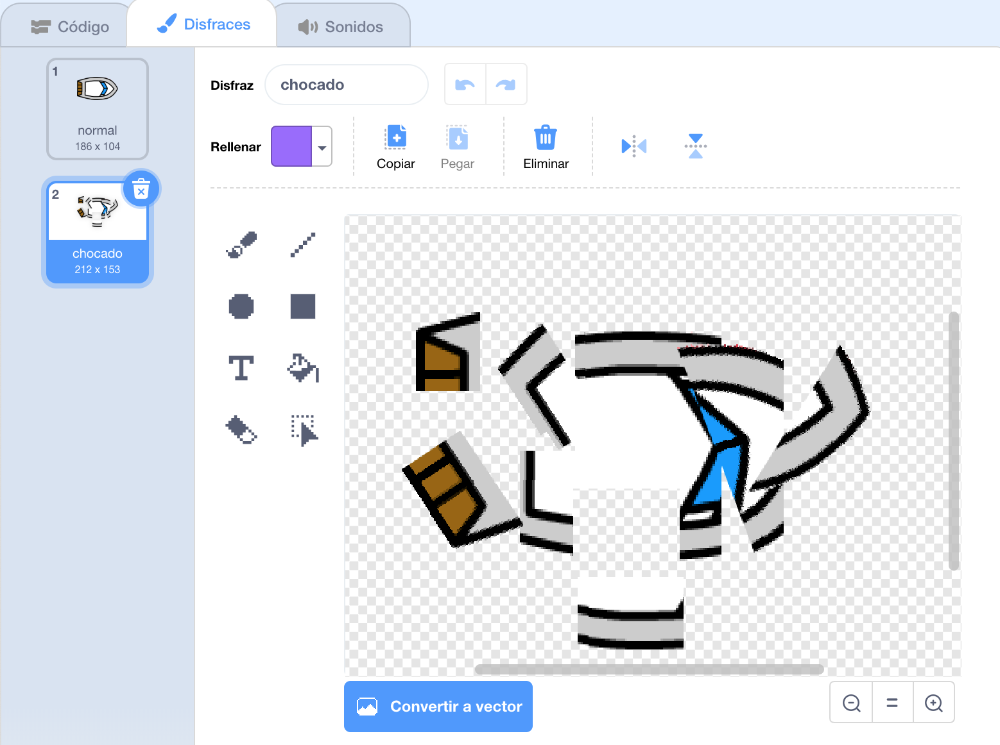
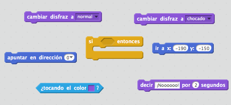
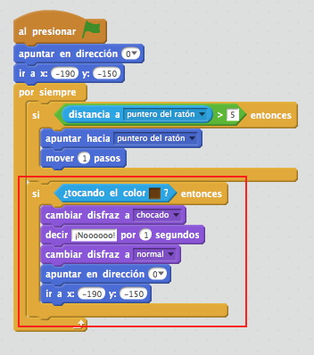
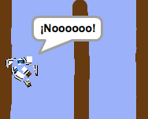

## ¡Chocando!

De momento, tu barco puede navegar a través de los obstáculos de madera. Vamos a arreglarlo.

\--- task \---

Necesitarás dos disfraces para tu barco, un disfraz normal y uno para cuando el choque. Duplica el disfraz del barco, y renombra uno "normal" y el otro "chocado".

\--- /task \---

\--- task \---

Haz clic en tu disfraz 'chocado', y elija la herramienta 'Seleccionar' para agarrar trozos del barco y mover y rotarlos para que parezca como si se hubiera chocado.

\--- /task \---

\--- task \---

Ahora agrega un código a tu barco para que se choque y se rompa cuando toque cualquier trozo de madera marrón.

\--- hints \--- \--- hint \--- Tendrás que añadir código dentro de tu bloque `por siempre` para que el código siga comprobando si el barco se ha chocado. `Si` el barco `está tocando` el color marrón de madera, necesitas `cambiar al disfraz chocado`, `decir ¡Noooo! por 2 segundos`, y `volver al disfraz normal`. Finalmente, necesitarás `orientar hacia arriba` e ` ir al punto de partida`. \--- /hint \--- \--- hint \--- Aquí están los bloques de código que necesitarás:  \--- /hint \--- \--- hint \--- Aquí está cómo debe ser tu código:  \--- /hint \--- \--- /hints \---

\--- /task \---

\--- task \---

También debes asegurarte de que tu barco siempre empiece con un aspecto 'normal'.

Si intentas navegar a través de un obstáculo de madera ahora, deberías ver que el barco se choca y vuelve al inicio.

\--- /task \---