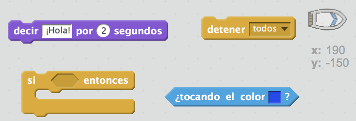
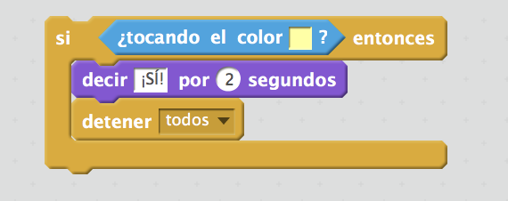

## Desafío: ¡ganar!

¿Sabes añadir otro bloque `si` al código de tu barco, para que el jugador gane cuando llegue a la isla desierta?

Cuando el barco llega a la isla desierta amarilla, el juego debería decir '¡Sí!' y acabar.

--- hints --- --- hint --- Tendrás que añadir más código dentro de tu bloque `por siempre` para que el código siga comprobando si el jugador ha ganado. `Si` el barco está `tocando con` el color de la isla ddel tesoro, debes `decir '¡Sí!' por 2 segundos` y luego `detener todos` para acabar el juego. --- /hint --- --- hint --- Aquí están los bloques que necesitarás:  --- /hint --- --- hint --- Aquí está cómo debe ser tu código: 

No olvides que el nuevo código deber ser dentro de tu bloque `por siempre`. --- /hint --- --- /hints ---
