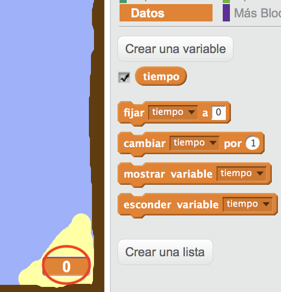
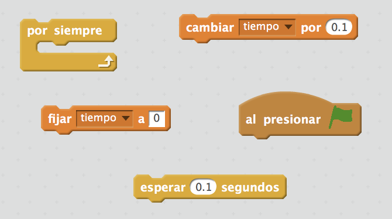
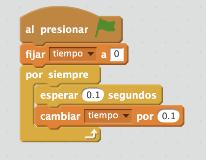
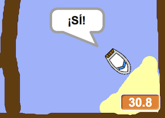

## Prueba de contrarreloj

Vamos a añadir un contador a tu juego, para que el jugador tenga que llegar a la isla desierta lo más rápido posible.

--- task ---

Añade a tu escenario una nueva variable llamada `tiempo`. Puedes cambiar la configuración de la nueva variable también.

[[[generic-scratch-add-variable]]]

--- /task ---

--- task ---

Ahora añade código a tu Escenario para que el contador cuente hasta que el barco llegue a la isla desierta.

--- hints --- --- hint --- En el Escenario, `cuando has hecho clic en la bandera verde`, `fija el tiempo a 0`. Dentro de tu bloque `por siempre`, primero tendrás que `esperar 0.1 segundos`, luego `cambiar tiempo por 0.1`. --- /hint --- --- hint --- Aquí están los bloques de código que necesitarás:  --- /hint --- --- hint --- Aquí está cómo debe ser tu código:  --- /hint --- --- /hints ---

--- /task ---

--- task ---

¡Ya está! ¡Prueba tu juego y trata de llegar lo más rápido posible a la isla desierta!

--- /task ---