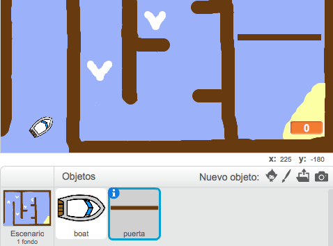

## Obstáculos y fuentes de energía

Este juego es _demasiado_ fácil – Vamos a añadir cosas para hacerlo más interesante.

+ Primero vamos a incluir algunos "propulsores" a tu juego, que harán que el barco navegue más rápido. Edita el fondo de tu escenario y añade algunas flechas blancas propulsoras.

	

+ A continuación puedes añadir código nuevo al bucle `por siempre` {.blockcontrol} de tu barco, para que avance 2 _pasos extra_ cada vez que toque un propulsor blanco.

	```blocks
	si <¿tocando el color [#FFFFFF]?> entonces
   		mover (3) pasos
	fin
	```

+ También puedes añadir una puerta giratoria, que tu barco tendrá que evitar. Añade un nuevo objeto con el nombre 'puerta', y que sea así:

	

	Asegúrate de que el color de la puerta sea el mismo que el color de las otras barreras de madera.

+ Fija el centro del objeto puerta.

	

+ Añade código a la puerta para hacer que gire lentamente `por siempre` {.blockcontrol}.

+ Prueba tu juego. Ahora deberías de tener una puerta giratoria que tienes que evitar.

	
