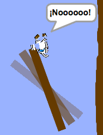

## Obstáculos y mejoras

Ahora mismo el juego es **demasiado** fácil, así que añadirás algunas cosas para hacerlo más interesante.

En primer lugar, se añadirán algunos 'aceleradores' para aumentar la velocidad del barco.

\--- task \---

Edita el fondo de tu Escenario añadiendo algunas flechas de 'aceleración' blancas.


\--- /task \---

\--- task \---

Ahora añade más bloques de código al bucle `por siempre`{:class="block3control"} del barco para que el objeto del barco se mueva tres pasos adicionales cuando toca una flecha blanca.


```blocks3
if <touching color [#FFFFFF] ?> then
move (3) steps
end
```

\--- /task \---

\--- task \---

Prueba tu juego para ver si tus nuevas flechas 'aceleradoras' incrementan la velocidad del barco.

\--- /task \---

A continuación añadirás una puerta giratoria que el barco tiene que evitar.

\--- task \---

Añade un nuevo objeto que se vea así, y llámalo 'puerta':


Asegúrate de que el color del objeto puerta es igual que el de los obstáculos de madera.


\--- /task \---

\--- task \---

Asegúrate de que el objeto puerta está centrado.


\--- /task \---

\--- task \---

Añade el código al objeto puerta para que gire lentamente para siempre.

\--- hints \--- \--- hint \---

Añade bloques de código al objeto de la puerta para que `gire 1 grado`{:class="block3motion"} `para siempre`{:class="block3control"}.

\--- /hint \--- \--- hint \---

Aquí están los bloques de código que necesitas:


```blocks3
por siempre
fin

girar cw (1) grados

cuando la bandera es pulsada
```

\--- /hint \--- \--- hint \---

Así es como debería verse tu nuevo código:


```blocks3
when flag clicked
forever
turn cw (1) degrees
end
```

\--- /hint \--- \--- /hints \---

\--- /task \---

\--- task \---

Prueba tu juego de nuevo. Ahora deberías tener una puerta giratoria que necesitas evitar al mover el barco.



\--- /task \---