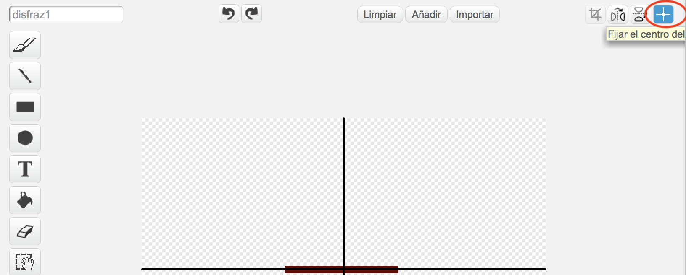

## Obstáculos y poderes

Ahora mismo este juego es *demasiado* fácil - vamos a añadir algo más para hacerlo más interesante.

--- task ---

Primero vamos a añadir algunos 'poderes' para hacer el barco más rápido. Edita el fondo de tu escenario y añade algunas flechas blancas para aumentar la velocidad.

--- /task ---

--- task ---

Ahora añade más código al bloque 'por siempre' de tu barco para que se mueva tres pasos más cuando toca una flecha blanca.

--- hints --- --- hint --- `Si` tu barco está `tocando una flecha blanca`, debería `moverse 3 pasos extras`.  
--- /hint --- --- hint --- Aquí están los bloques de código que necesitarás:  --- /hint --- --- hint --- Aquí está cómo debe ser tu código:  --- /hint --- --- /hints ---

--- /task ---

--- task ---

También puedes añadir una puerta giratoria como obstáculo para tu barco. Añade un nuevo objeto llamado 'puerta' que se parece así:

Asegúrate de que el color de la puerta y de los obstáculos de madera es lo mismo.

--- /task ---

--- task ---

Selecciona el centro del objeto 'puerta'.

--- /task ---

--- task ---

Añade el código a la puerta para que gire lentamente por siempre.

--- hints --- --- hint --- Añade código a éste objeto para que `gira 1 grado` `por siempre`. --- /hint --- --- hint --- Aquí están los bloques que necesitarás:  --- /hint --- --- hint --- Aquí está cómo debe ser tu código:  --- /hint --- --- /hints ---

--- /task ---

--- task ---

Prueba tu juego. Ahora deberías tener una puerta giratoria para evitar.

--- /task ---