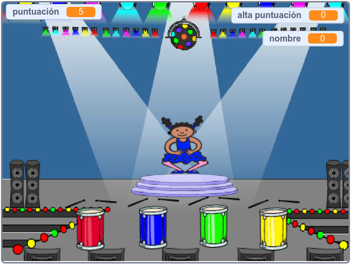

## What next?

¡Felicitaciones por haber completado el proyecto "Carrera de botes"! ¿Le gustaría probar algo un poco más desafiante?

Podrá probar el proyecto de [Memoria](https://projects.raspberrypi.org/en/projects/memory?utm_source=pathway&utm_medium=whatnext&utm_campaign=projects).

\--- no imprimir \--- Presione sobre el indicador verde para comenzar. Watch the sequence of colours shown by the dancer's dress and listen to the accompanying drum beats, then repeat the colours back to her. If you get the colours' order wrong, it's game over!

  <iframe allowtransparency="true" width="485" height="402" src="//scratch.mit.edu/projects/embed/284452634/?autostart=false" frameborder="0" allowfullscreen scrolling="no" mark="crwd-mark"></iframe> 

\--- /no-print \---

\--- print-only \---  \--- /print-only \---