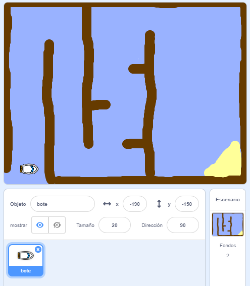

## Introducción

\--- task \--- Abra el proyecto inicial.

**Con conexión:** abra el proyecto inicial con conexión en [rpf.io/boat-race-starter-on](http://rpf.io/boat-race-starter-on){:target="_blank"}, y presióne el botón **Remix**.

**Sin conexión:** descargue el proyecto inicial sin conexión desde [rpf.io/p/en/boat-race-get](http://rpf.io/p/en/boat-race-get){:target="_blank"}, y luego abralo utilizando el editor sin conexión.

En caso que necesite descargar e instalar el editor Scratch sin conexión, lo puede encontrar en [rpf.io/scratchoff](http://rpf.io/scratchoff). \--- /task \---

\--- task \---

El proyecto incluye un bote y una pista de carreras de fondo con:

- Madera que el bote debe evitar
- Una isla desierta que el bote debe encontrar
    
    

\--- /task \---