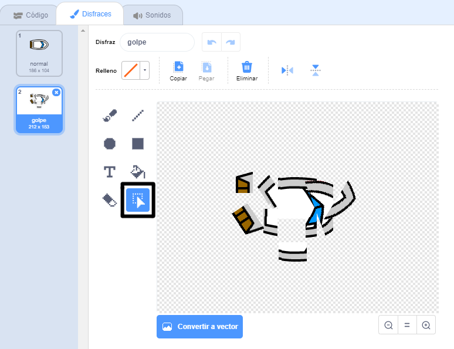

## ¡Estrellado!

¡Por el momento, el bote solo puede navegar a través de las vallas de madera! Es el momento de solucionarlo.

\--- task \---

Necesita dos atuendos para su bote: un atuendo normal y uno para cuando el bote se estrelle. Duplique el atuendo de su bote y nombre a uno como "normal" y a otro como "golpe".

\--- /task \---

\--- task \---

Presione el atuendo "golpe" y utilice la herramienta **Seleccionar** para tomar las piezas del atuendo y moverlas y rotarlas para que el bote parezca que se ha estrellado en mil pedazos.



\--- /task \---

\--- task \---

Ahora añada el código a su bote para que se estrelle y se destruya cuando toque alguna valla de madera marrón.

Necesita añadir un bloqueo de código dentro de su circuito `infinito` para que el código continue analizando si el bote se ha estrellado y, de ser así, el código deberá reiniciar la posición del bote.

`si` el bote se encuentra `touching` tocando el color marrón de la madera, necesitará `modificar el atuendo de golpe`, `diga Noooo! durante 2 segundos `, y luego ` regrese al atuendo normal`. Para finalizar, necesitará `señalar` y `dirijase a la posición inicial `.

Estos son los bloqueos de los códigos que necesitará: 

```blocks3
si <touching color [ ] ?> luego
fin

dirijase a x: (-190) y: (-150)

modifique el atuendo a (golpe v)

muevase en dirección (0)

modifique el atuendo a (normal v)

diga [Noooooo!] por (2) segundos
```

Así es como el código debería lucir: 

```blocks3
cuando presione el indicador
seleccione en dirección (0)
dirijase a x: (-190) y: (-150)
siempre
si <(la distancia hacia (el señalador del ratón v)) > [5]> luego
señale hacia (el señalador del ratón v)
muevase (1) paso
fin
si <touching color [#663b00] ?> luego
modifique el atuendo a (golpe v)
diga [Noooooo!] por (2) segundos
modifique el atuendo a (normal v)
seleccione en dirección (0)
dirijase a x: (-190) y: (-150)
fin
```

\--- /hint \--- \--- /hints \---

\--- /task \---

\--- task \---

También debería añadir un código para asegurarse de que su bote siempre comience luciendo "normal".

Pruebe su código nuevamente. Si ahora intenta navegar el bote a través de las vallas de madera, el mismo debería estrellarse y volver a la posición inicial.


\--- /task \---