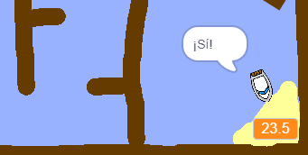

## Añadir un temporizador

Añada un temporizador a su juego para que el jugador deba dejar la isla lo más rápido posible.

\--- task \---

Añada a su proyecto una nueva variable llamada `tiempo`.


[[[generic-scratch3-add-variable]]]

Además, puede elegir una aspecto para su temporizador al cambiar la manera en que se visualiza la nueva variable.

\--- /task \---

\--- task \---

Añada un bloqueo del código a su proyecto para que el temporizador cuente hasta que el bote llega a la isla.

\--- hints \--- \--- hint \--- En el proyecto, `cuando se seleccione el indicador verde`, `establezca el tiempo a 0`. Dentro del circuito `infinito`, necesitará primero `esperar 0.1 segundos`, luego `modifique el tiempo a 0.1`. \--- /hint \--- \--- hint \--- Los bloqueos de código que necesitará se encuentran a continuación: 

```blocks3
modifique el [tiempo v] por (0.1)

cuando seleccione el indicador

siempre
fin

espere (0.1) segundos

establezca el [tiempo v] a [0]
```

\--- /hint \--- \--- hint \--- Así debería lucir su nuevo código: 

```blocks3
cuando seleccione el indicador
estableza el [tiempo v] a [0]
siempre
aguarde (0.1) segundos
modifique el [tiempo v] a (0.1)
fin
```

\--- /hint \--- \--- /hints \---

\--- /task \---

\--- task \---

Test out your game and see how quickly you can get the boat to the island!



\--- /task \---