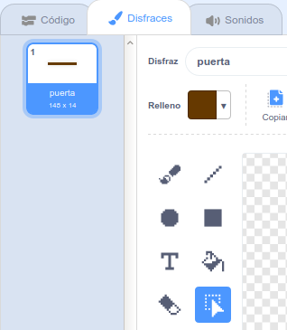

## Obstáculos e impulsores

En este punto, el juego parece **muy** fácil, por eso, necesita agregar más elementos para hacerlo lucir más interesante.

Primero, debe añadir algunos impulsores para aumentar la velocidad del bote.

\--- task \---

Edite el fondo del Escenario agregando algunas flechas blancas impulsoras.


\--- /task \---

\--- task \---

Ahora agrega mas código de bloques al ciclo`infinito` de tu objeto bote para que se realice tres pasos extras cuando toque una flecha blanca. 

```blocks3
si <touching color [#FFFFFF] ?> luego
mover (3) pasos
fin
```

\--- /task \---

\--- task \---

Pruebe su juego para determinar si la nueva flecha impulsora aumenta la velocidad de su bote.

\--- /task \---

Luego, añada un portal giratorio que el bote deberá evitar.

\--- task \---

Añada un nuevo portal que se vea igual y nómbrelo "portal":


Asegurese de que el color del portal sea el mismo que el de las vallas de madera.



\--- /task \---

\--- task \---

Asegurese de que el centro del portal se encuentre ubicado en el justo centro.


\--- /task \---

\--- task \---

Añada el código al portal para crear una rotación lenta infinita.

\--- hints \--- \--- hint \--- Add code blocks to the gate sprite so that it `turns 1 degree`{:class="block3motion"} `forever`{:class="block3control"}. \--- /hint \--- \--- hint \--- Here are the code blocks you need: 

```blocks3
siempre
fin

gire (1) grado en onda contínua

cuando seleccione el indicador
```

\--- /hint \--- \--- hint \--- Here's what your new code should look like: 

```blocks3
cuando seleccione el indicador
siempre
gire (1) grado en onda continua
fin
```

\--- /hint \--- \--- /hints \---

\--- /task \---

\--- task \---

Prueba tu juego de nuevo. Ahora debería tener una puerta giratoria que necesita para mover su bote.


\--- /task \---