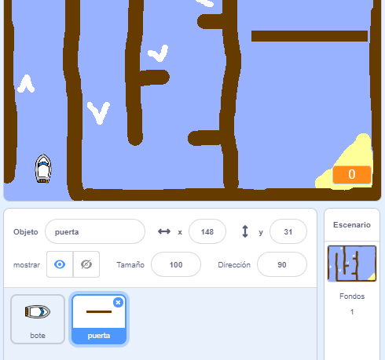
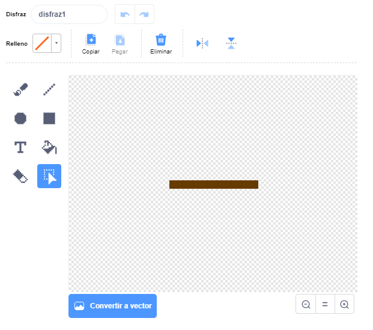
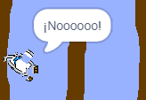

## Obstáculos e impulsores

En este punto, el juego parece **muy** facil, por eso, necesita añadir más elementos para hacerlo lucir más interesante.

Primero, debe añadir algunos impulsores para aumentar la velocidad del bote.

\--- task \---

Edite el escenario de su proyecto y añada algunas flechas impulsoras blancas.


\--- /task \---

\--- task \---

Luego, añada más bloqueos de cóodigo al circuito `infinito` de su bote para que se realice tres movimientos extra cuando esté en contacto con una flecha blanca. 

```blocks3
si <touching color [#FFFFFF] ?> luego
realice (3) movimientos
fin
```

\--- /task \---

\--- task \---

Pruebe su juego para determinar si la nueva flecha impulsora aumenta la velocidad de su bote.

\--- /task \---

Luego, añada un portal giratorio que el bote deberá evitar.

\--- task \---

Añada un nuevo portal que se vea igual y nómbrelo "portal":



Asegurese de que el color del portal sea el mismo que el de las vallas de madera.

\--- /task \---

\--- task \---

Asegurese de que el centro del portal se encuentre ubicado en el centro.



\--- /task \---

\--- task \---

Añada el código al portal para crear una rotación lenta infinita.

\--- hints \--- \--- hint \--- Añada el bloqueo del código al portal para que `gire 1 grado` `infinitamente`. \--- /hint \--- \--- hint \--- Los bloqueos de código que necesitará se encuentran a continuación: 

```blocks3
siempre
fin

gire (1) grado en onda contínua

cuando seleccione el indicador
```

\--- /hint \--- \--- hint \--- Así debería lucir su nuevo código: 

```blocks3
cuando seleccione el indicador
siempre
gire (1) grado en onda continua
fin
```

\--- /hint \--- \--- /hints \---

\--- /task \---

\--- task \---

Pruebe su juego nuevamente. En este momento, debería haber un portal giratorio y usted deberá mover el bote al rededor del mismo.



\--- /task \---