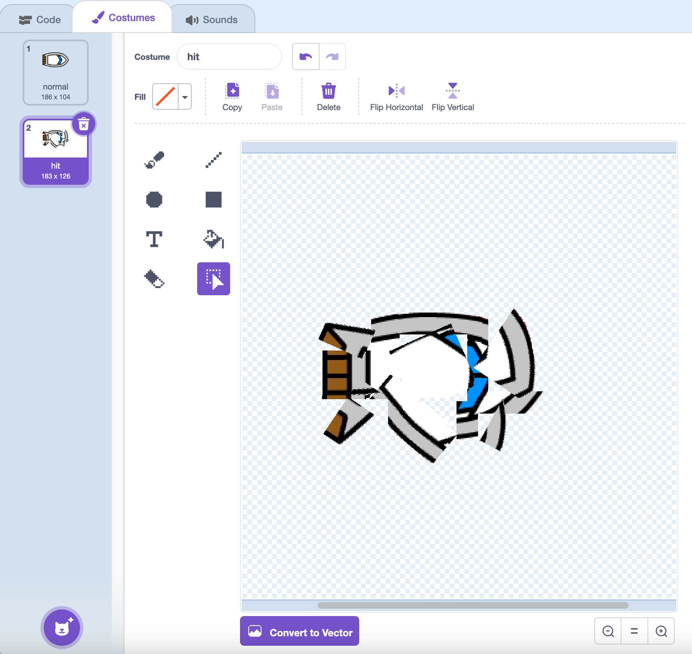

## Krahh!

Praegu saab paadi purjus lihtsalt läbi puidust tõkete! Sa hakkad selle kohe lahendama.

\--- ülesanne \---

Sa pead oma paadi jaoks olema kaks kostüümi: üks tavaline kostüüm ja teine paadi jooksmisel. Dubleerige oma paadisõidu kostüüm ja nimetage üks kostüüm „normaalne“ ja teine „löögi”.

\--- / ülesanne \---

\--- ülesanne \---

Klõpsa oma "hit" kostüümile ja kasuta **Select** tööriista, et haarata kostüümi tükid ja liikuda ja pöörata, et paat näeks välja nagu see on kokku kukkunud.



\--- / ülesanne \---

\--- ülesanne \---

Nüüd lisage oma paadile kood nii, et see jookseb kokku ja puruneb, kui see puudutab pruuni puidust tõkkeid.

\--- hints \--- \--- vihje \--- Peate lisama oma `igavesti`{: class = "block3control"} silmusesse koodiplokke nii, et teie kood kontrollib, kas paadi purjus on kukkunud, ja Kui see on kukkunud, peab kood paadi sprite asendist lähtuma.

`kui`{: class = "block3control"} paat on `puudutades`{: class = "block3sensing"} puidu pruuni värvi, peate `lülituma tabamust kostüümile`{: class = "block3looks"} , `ütle Noooo! 2 sekundit`{: class = "block3looks"} ja seejärel `tagasi tavalisele kostüümile`{: class = "block3looks"}. Lõpuks peate `punkti üles`{: class = "block3motion"} ja `minema stardipositsioonile`{: class = "block3motion"}.

\--- / vihje \--- \--- vihje \--- Siin on vajalikud koodiplokid: 

```blocks3
kui <touching color [ ] ?> siis
ots

minge x: (-190) y: (-150)

lüliti kostüüm (löögi v)

punkti suunas (0)

lüliti kostüüm (tavaline v)

ütle [Noooooo!] (2) sekundit
```

\--- / vihje \--- \--- vihje \--- Siin on, mida teie kood peaks välja nägema: 

```blocks3
kui lipp klõpsas
punkti suunas (0)
minge x: (-190) y: (-150)
igavesti
kui <(kaugus (hiirekursor v)) > [5]> siis
punkti (hiir- pointer v)
liikuda (1) sammud
lõpp
kui <touching color [#663b00] ?> siis
lüliti kostüümi (löö v)
öelda [Noooooo!] (2) sekundit
lüliti kostüüm (tavaline v)
punkti suunas (0)
punkti suunas (0) 
 minge x: (-190) y: (-150)
lõppu
```

\--- / vihje \--- \--- / vihjed \---

\--- / ülesanne \---

\--- ülesanne \---

Samuti peaksite lisama koodi, et veenduda, et teie paadi sprite hakkab alati välja vaatama "normaalset".

Testige oma koodi uuesti. Kui proovite paati sõita läbi puidust tõkke, peaks paat jooksma ja seejärel tagasi oma lähtepositsiooni.


\--- / ülesanne \---