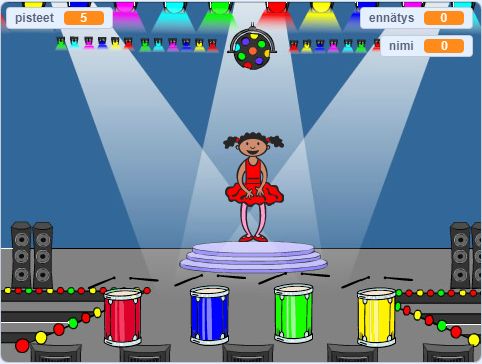

## Mitä seuraavaksi?

Onnittelut Boat race -hankkeen toteuttamisesta! Haluatko kokeilla jotain hieman haastavampaa?

Voit kokeilla [Memory](https://projects.raspberrypi.org/en/projects/memory?utm_source=pathway&utm_medium=whatnext&utm_campaign=projects) -projektia.

\--- no-print \--- Aloita vihreä lippu. Katso tanssijapuvun näyttämien värien sekvenssiä ja kuuntele mukana tulevia rummun lyöntejä, ja toista sitten värit takaisin hänelle. Jos saat värien tilauksen väärin, peli on ohi!

  <iframe allowtransparency="true" width="485" height="402" src="//scratch.mit.edu/projects/embed/284452634/?autostart=false" frameborder="0" allowfullscreen scrolling="no" mark="crwd-mark"></iframe> 

\--- / ei-tulosta \---

\--- vain tulostettava \---  \--- / vain tulostus \---