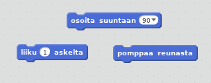

\--- challenge \---

## Haaste: enemmän esteitä!

Voitko lisätä esteitä peliisi? Seuraavassa on joitain ideoita:

\--- task \---

Voit lisätä taustakuvaasi vihreää levää ja tehdä muutoksia peliin niin, että levä hidastaa venettä, kun pelaaja koskettaa sitä.

\--- hints \--- \--- hint \--- Voit käyttää tähän `odota` -lohkoa:  \--- /hint \--- \--- /hints \---

\--- /task \---

\--- task \---

Voit lisätä liikkuvan kohteen kuten ajopuun tai hain!

\--- hints \--- \--- hint \--- Nämä lohkot voivat auttaa sinua siirtämään uutta kohdetta:

Jos uusi kohde ei ole ruskea, sinun on lisättävä venekoodiisi:

 \--- /hint \--- \--- /hints \---

\--- /task \---

\--- /challenge \---