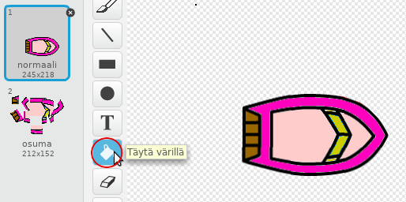
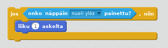

\--- challenge \---

## Haaste: lisää veneitä!

Voitko muuntaa pelisi kilpailuksi kahden pelaajan välillä? Toisen pelaajan on ohjattava venettä eteenpäin ja kääntyä vasemmalle ja oikealle nuolinäppäimiä käyttäen.

\--- hints \--- \--- hint \--- Kopioi vene ja vaihda vene2:n väriä.

 \--- /hint \--- \--- hint \--- Tee kaksi venettä jotka lähtevät eri paikoista, muuttamalla tätä koodia:

 \--- /hint \--- \--- hint \--- Poista vene2:sta koodi, joka käyttää hiirtä, ja korvaa se koodilla joka hallitsee vene2:ta nuolinäppäimillä. \--- /hint \--- \--- hint \--- Tässä on koodi jolla siirrät vene2:sta eteenpäin:

 \--- /hint \--- \--- hint \--- Tarvitset myös koodia *veneen kääntämiseksi* kun vasenta tai oikeaa nuolinäppäintä painetaan. \--- /hint \--- \--- /hints \---

\--- /challenge \---