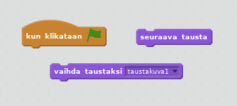

 [Valmis projekti koodi] (resources/BoatRace-Finished.sb2) {: download = 'BoatRace-Finished.sb2'} [Valmis projekti verkossa] (http://scratch.mit.edu/projects/63957956/#editor) {: target = "_ blank"}

\--- challenge \---

## Haaste: enemmän tasoja!

Voitko luoda lisää taustakuvia ja sallia pelaajan valita tasojen välillä?

\--- hints \--- \--- hint \---  \--- /hint \--- \--- /hints \---

\--- /challenge \---