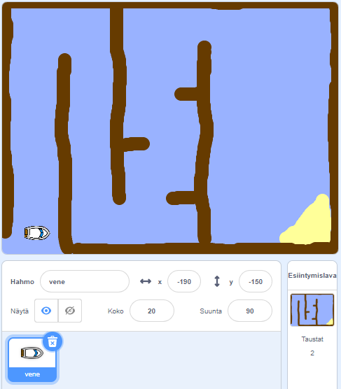

## Näin pääset alkuun

\--- task \--- Open the starter project.

**Verkossa:** avaa aloitusprojekti verkossa osoitteessa [rpf.io/boat-race-starter-on](http://rpf.io/boat-race-starter-on){:target="_blank"}, ja klikkaa kohtaa **Remix**.

**Offline:** Lataa offline aloitusprojekti osoitteesta [rpf.io/p/en/boat-race-get](http://rpf.io/p/en/boat-race-get){:target="_blank"}, ja avaa se sitten offline editorilla.

Jos sinun täytyy ladata ja asentaa Scratch offline -editori, löydät sen osoitteesta [rpf.io/scratchoff](http://rpf.io/scratchoff). \--- / tehtävä \---

\--- task \---

Projekti sisältää veneen kuvan ja radan taustakuvan jossa on myös:

- Puuta, jota veneen on vältettävä
- Autiosaari, jonne veneen on päästävä
    
    

\--- /task \---