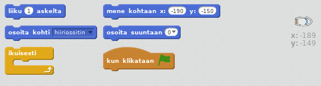
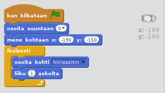
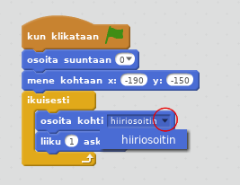
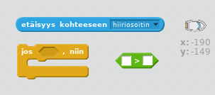
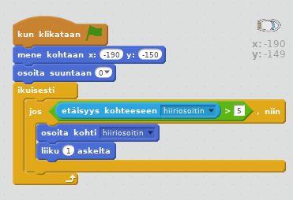

## Veneen ohjaaminen

\--- task \---

Hallitset venettä hiirelläsi. Lisää koodia veneeseesi niin, että se lähtee vasemmasta alakulmasta osoittaen ylöspäin ja seuraa hiiren osoitinta. **Testaa koodisi** varmistaaksesi, että se tekee sen, mitä sen pitäisi tehdä.

\--- hints \--- \--- hint \--- Kun `vihreää lippua klikataan`, sinun on siirrettävä veneesi lähtöpisteeseen `mene kohtaan` ja `osoita suuntaan ylös`. Seuraavaksi sen tulisi `osoittaa kohti hiiren osoitinta` ja `liikkua 1 askel`. Tämä on toistettava `ikuisesti`.

\--- /hint \--- \--- hint \--- Seuraavassa on tarvitsemasi koodilohkot:  \--- /hint \--- \--- hint \--- Tältä koodisi pitäisi näyttää:  \--- /hint \--- \--- /hints \---

\--- /task \---

\--- task \---

Testaa venettäsi klikkaamalla lippua ja liikuttamalla hiirtä. Purjehtiiko vene kohti hiirtä?

## \--- collapse \---

title: Jos sinulla on ongelmia ...

## image:images/image.png

**Huomaa:** Scratchissä on tällä hetkellä vika, joten veneesi ei ehkä liiku hiiren osoittimen suuntaan. Jos näin käy, napsauta `osoita kohti` -lohkon nuolta ja valitse uudelleen `hiiriosoitin`.

 \--- /collapse \---

\--- /task \---

\--- task \---

Mitä tapahtuu, jos vene saavuttaa hiiren osoittimen? Kokeile.

\--- /task \---

\--- task \---

Jos haluat estää tämän, sinun on lisättävä koodiisi `jos` -lohko, niin että vene liikkuu vain, jos se on enemmän kuin 5 pikselin etäisyydellä hiirestä.

\--- hints \--- \--- hint \--- Veneen pitäisi osoittaa kohti hiiren osoitinta ja liikkua vain, ` jos` `etäisyys kohteeseen hiiriosoitin` on `suurempi kuin 5 pikseliä`. \--- /hint \--- \--- hint \--- Tässä on koodilohkot, jotka sinun on lisättävä veneen koodiin:  \--- /hint \--- \--- hint \--- Tältä koodisi pitäisi näyttää:  \--- /hint \--- \--- /hints \---

\--- /task \---

\--- task \---

Testaa venettäsi uudelleen tarkistaaksesi, onko ongelma korjattu.

\--- /task \---