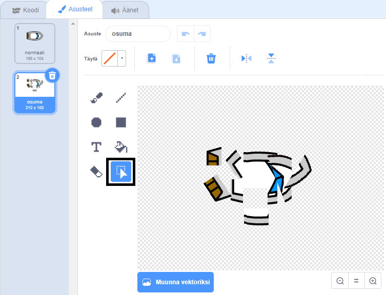

## Törmääminen!

Tällä hetkellä vene voi yksinkertaisesti purjehtia puisten esteiden läpi! Tämän sinä tulet korjaamaan nyt.

\--- task \---

Duplicate your boat sprite's costume, and name one costume `normal` and the other `hit`.

[[[generic-scratch3-duplicate-costumes]]]

\--- /task \---

\--- task \---

Click on your `hit` costume, and use the **Select** tool to grab pieces of the costume and move and rotate them to make the boat look like it has crashed to pieces.



\--- /task \---

\--- task \---

Add code blocks inside your `forever`{:class="block3control"} loop so that your code keeps checking if the boat sprite has touched any brown wooden barriers.

[[[scratch3-set-block-input-colour-with-eyedropper]]]

If it has crashed, reset the boat sprite's position.

Koodisi tulisi näyttää seuraavalta:

```blocks3
when flag clicked
point in direction (0)
go to x: (-190) y: (-150)
forever
if <(distance to (mouse-pointer v)) > [5]> then
point towards (mouse-pointer v)
move (1) steps
end
+if <touching color [#663b00] ?> then
switch costume to (hit v)
say [Noooooo!] for (2) seconds
switch costume to (normal v)
point in direction (0)
go to x: (-190) y: (-150)
end
```

\--- /task \---

\--- task \---

Add code to make sure that your boat sprite always starts out looking 'normal':

```blocks3
when flag clicked
+switch costume to (normal v)
point in direction (0)
go to x: (-190) y: (-150)
forever
if <(distance to (mouse-pointer v)) > [5]> then
point towards (mouse-pointer v)
move (1) steps
end
if <touching color [#663b00] ?> then
switch costume to (hit v)
say [Noooooo!] for (2) seconds
switch costume to (normal v)
point in direction (0)
go to x: (-190) y: (-150)
end
```

\--- /task \---

\--- task \---

Test your code again.

If you try to sail the boat through a wooden barrier now, the boat should crash and then move back to its starting position.


\--- /task \---