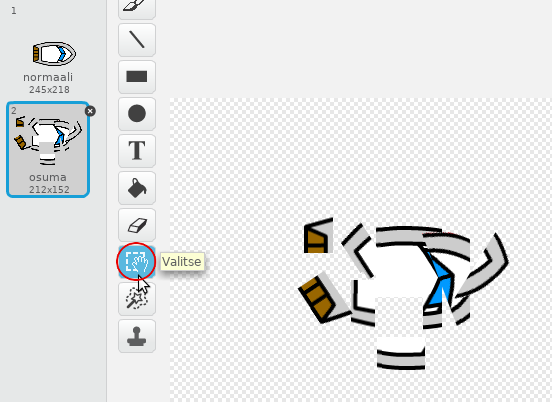
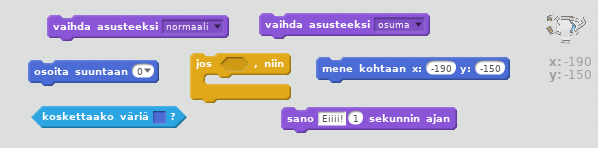
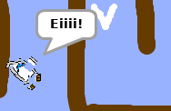

## Törmäys!

Tällä hetkellä veneesi voi purjehtia puisten esteiden läpi! Korjataan se.

\--- task \---

Tarvitset kaksi asustetta veneellesi, yksi normaali asuste ja yksi veneen törmäykseen. Kopioi vene asuste ja nimeä ensimmäinen asuste nimellä "normaali" ja toinen "osuma".

\--- /task \---

\--- task \---

Napsauta osuma asustettasi ja valitse Valitse-työkalulla veneen osia ja siirrä ja kierrä niitä niin, että se näyttää siltä kuin se olisi törmännyt.

\--- /task \---

\--- task \---

Nyt, lisää koodia veneeseesi niin, että se törmää ja hajoaa, kun se koskettaa ruskeita puupaloja.

\--- hints \--- \--- hint \--- Sinun täytyy lisätä koodia `ikuisesti` silmukkaan niin, että koodisi tarkkailee onko vene törmännyt. `Jos` vene `koskettaa` puun ruskeaa väriä, sinun täytyy `vaihda osuma asuste`, ja `sano Eiiii! 1 sekunnin ajan `, ja sitten `vaihda normaali asuste`. Lopuksi sinun täytyy `osoita suuntaan 0` ja `mene kohtaan aloitus`. \--- /hint \--- \--- hint \--- Seuraavassa on tarvitsemasi koodilohkot:  \--- /hint \--- \--- hint \--- Tältä koodisi pitäisi näyttää:  \--- /hint \--- \--- /hints \---

\--- /task \---

\--- task \---

Varmista myös, että vene aloittaa aina normaali asusteessa.

Jos yrität purjehtia puisen esteen läpi, sinun pitäisi nähdä, että veneesi törmää ja siirtyy takaisin alkuun.

\--- /task \---