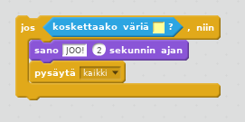

## Haaste: voitto!

Voitko lisätä `jos` lausekkeen venekoodisi, niin että pelaaja voittaa, kun hän pääsee autiolle saarelle?

Kun vene saapuu keltaiselle autiosaarelle, pelin pitäisi sanoa "JOO!" ja sen pitäisi lopettaa.

\--- hints \--- \--- hint \--- Sinun on lisättävä koodia `ikuisesti` silmukkaan, jotta koodisi voi tarkkailla, onko pelaaja voittanut. `Jos` vene `koskettaako väriä ?` autiosaaren väri, sinun täytyy `sano "JOO!" 2 sekunnin ajan` ja sitten `pysäytä kaikki` lopettaaksesi pelin. \--- /hint \--- \--- hint \--- Tässä on tarvittavia koodilohkoja:  \--- /hint \--- \--- hint \--- Tältä koodisi pitäisi näyttää: 

Älä unohda, että uuden koodin on oltava `ikuisesti` -silmukan sisällä. \--- /hint \--- \--- /hints \---