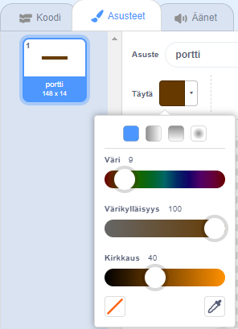

## Obstacles and boosters

Add some new things to make your game more interesting!

First, you'll add some boosters to speed up the boat.

\--- task \---

Draw some white booster arrows on you backdrop by painting the backdrop on the stage.


**Tip:** You can make your backdrop look like this ☝️ by clicking the purple 'next backdrop'{:class="block3looks"} block in the looks menu.

\--- /task \---

\--- task \---

Now add more code blocks to your boat's `forever`{:class="block3control"} loop so that the boat sprite moves three extra steps when it touches a white arrow.


```blocks3
if <touching color [#FFFFFF] ?> then
move (3) steps
end
```

\--- /task \---

\--- task \---

Test your game to see whether your new booster arrows speed up the boat.

\--- /task \---

Next you'll add a spinning gate that the boat has to avoid.

\--- task \---

Paint a new sprite that looks like this, and call it 'gate':


Make sure that the colour of the gate sprite is the same as the colour of the wooden barriers.



**Tip:** If you are having trouble selecting the colour of the barriers, you can set the colours to: Colour: 9 Saturation: 100 Brightness: 40

\--- /task \---

\--- task \---

Make sure that the centre of the gate sprite is positioned in the middle. You may need to resize the gate sprite if it is too big.


\--- /task \---

\--- task \---

Add code blocks to the gate sprite so that it `turns 1 degree`{:class="block3motion"} `forever`{:class="block3control"}.

Uuden koodisi tulisi näyttää seuraavalta:


```blocks3
when flag clicked
forever
turn cw (1) degrees
end
```

\--- /task \---

\--- task \---

Test your game again. You should now have a spinning gate that you need to steer your boat around.


\--- /task \---