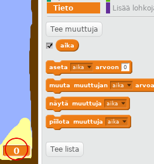
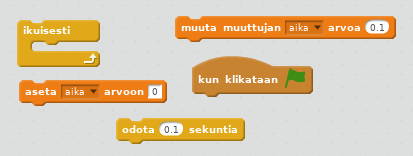
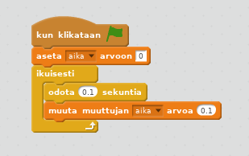
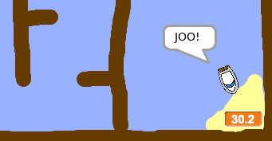

## Aikahaaste

Lisätään peliin ajastin, joten pelaajan on päästävä autiomaahan niin pian kuin mahdollista.

\--- task \---

Lisää uusi muuttuja `aika` esiintymislavalle. Voit myös muuttaa uuden muuttujan näyttöä.

[[[generic-scratch-add-variable]]]

\--- /task \---

\--- task \---

Lisää koodia esiintymislavalle niin, että ajastin laskee, kunnes vene saapuu autiosaarelle.

\--- hints \--- \--- hint \--- Esiintymislavalla, `kun vihreää lippua klikataan`, `aseta aika arvoon 0`. `ikuisesti` lohkossa, ensin `odota 0,1 sekuntia`, sitten `muuta muuttujan aika arvoa 0,1`. \--- /hint \--- \--- hint \--- Seuraavassa on tarvitsemasi koodilohkot:  \--- /hint \--- \--- hint \--- Tältä koodisi pitäisi näyttää:  \--- /hint \--- \--- /hints \---

\--- /task \---

\--- task \---

Se siitä! Testaa peliä ja kokeile kuinka nopeasti pääset autiosaarelle!

\--- /task \---