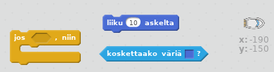
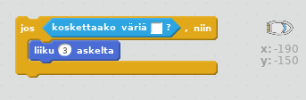
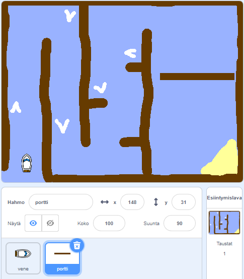
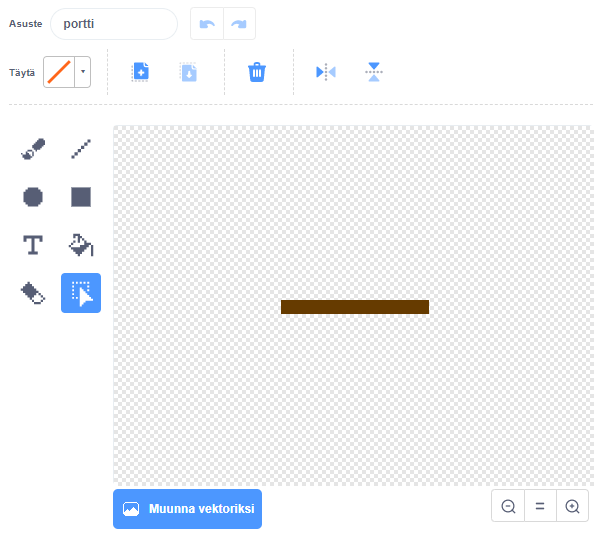
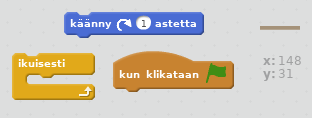
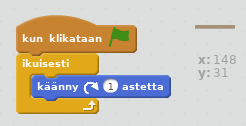
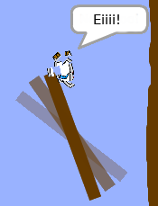

## Esteet ja vauhdittajat

Tällä hetkellä tämä peli on *aivan* liian helppo - lisäämme asioita, jotta se olisi mielenkiintoisempi.

\--- task \---

Aloitamme ensin lisäämällä peliisi vauhtia veneen nopeuttamiseksi. Muokkaa esiintymislavasi taustakuvaa ja lisää joitain valkoisia vauhtinuolia.

\--- /task \---

\--- task \---

Lisää nyt koodia veneen ikuisesti -silmukkaan niin, että se liikuttaa venettä kolme lisäaskelta, kun se koskettaa valkoista vauhtinuolta.

\--- hints \--- \--- hint \--- `Jos` veneesi `koskettaa valkoista vauhtinuolta`, sen pitäisi `siirtyä 3 ylimääräistä askelta`.  
\--- /hint \--- \--- hint \--- Seuraavassa on tarvittavia koodilohkoja:  \--- /hint \--- \--- hint \--- Tältä koodisi pitäisi näyttää:  \--- /hint \--- \--- /hints \---

\--- /task \---

\--- task \---

Voit myös lisätä pyörivän portin, jota veneen on vältettävä. Lisää uusi hahmo nimeltään "portti", joka näyttää tältä:

Varmista, että portin väri on sama kuin puisten esteiden väri.

\--- /task \---

\--- task \---

Aseta portti -hahmon keskipiste.

\--- /task \---

\--- task \---

Lisää koodia porttiisi, jotta se pyörii hitaasti ikuisesti.

\--- hints \--- \--- hint \--- Lisää koodia portti hahmoon niin, että se `kääntyy 1 aste` `ikuisesti`. \--- /hint \--- \--- hint \--- Seuraavassa on tarvitsemasi koodilohkot:  \--- /hint \--- \--- hint \--- Tältä koodisi pitäisi näyttää:  \--- /hint \--- \--- /hints \---

\--- /task \---

\--- task \---

Testaa peli. Sinulla on nyt pyörivä portti, jota sinun on vältettävä.

\--- /task \---