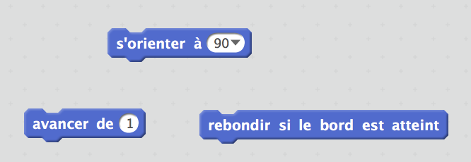
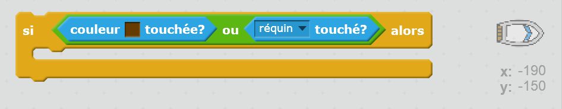

\--- challenge \---

## Défi: plus d'obstacles!

Peux-tu ajouter plus d'obstacles à ton jeu? Voici quelques idées:

\--- task \---

Tu pourrais ajouter du mucus vert à ton arrière-plan et faire des modifications au jeu pour que le bateau ralentisse quand il le touche.

\--- hints \--- \--- hint \--- Pour ce faire, tu peux utiliser un bloc `attendre`:  \--- /hint \--- \--- /hints \---

\--- /task \---

\--- task \---

Tu pourrais ajouter un objet en movement, comme un rondin de bois ou un requin!

\--- hints \--- \--- hint \--- Ces blocs peuvent t'aider à déplacer ton nouvel objet:

Si ton nouvel objet n'est pas marron, tu devras ajouter ce qui suit au code de ton bateau:

 \--- /hint \--- \--- /hints \---

\--- /task \---

\--- /challenge \---