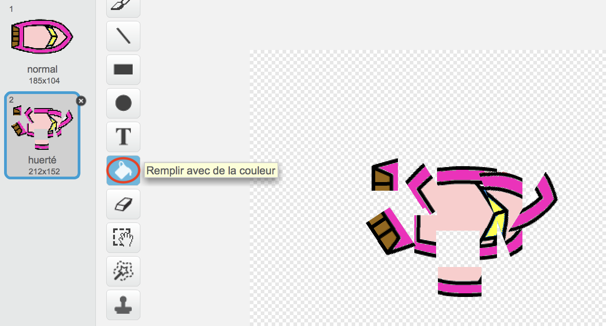
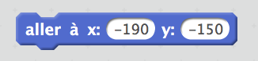
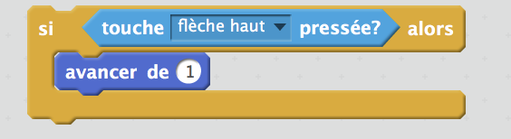

\--- challenge \---

## Défi: plus de bateaux!

Peux-tu transformer ton jeu en une course entre 2 joueurs? Le deuxième joueur devra contrôler son bateau en appuyant sur la flèche « haut » pour avancer et les flèches « gauche » et « droite » pour tourner.

\--- hints \--- \--- hint \--- Fais une copie du bateau et change la couleur du bateau2.

 \--- /hint \--- \--- hint \--- Fais commencer les deux bateaux à des endroits différents en changeant ce code:

 \--- /hint \--- \--- hint \--- Efface le code du deuxième bateau qui utilise la souris et remplace-le avec un autre pour pouvoir le contrôler avec les touches fléchées. \--- /hint \--- \--- hint \--- Voici le code dont tu auras besoin pour avancer le deuxième bateau:

 \--- /hint \--- \--- hint \--- Tu auras également besoin de code pour *tourner* le bateau lorsque les touches fléchées gauche et droite sont efoncées. \--- /hint \--- \--- /hints \---

\--- /challenge \---